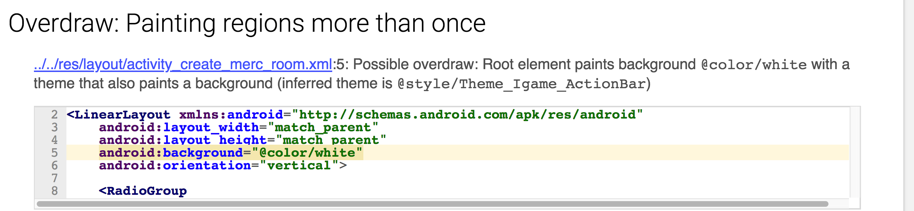
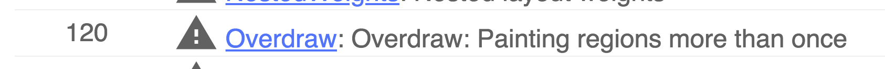
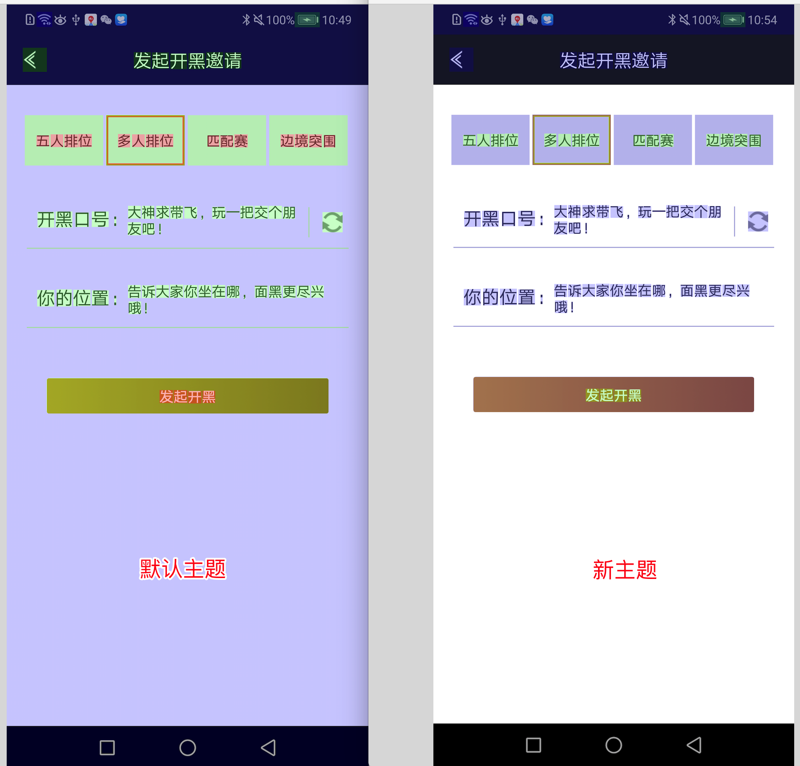

# Lint 的使用技巧

## Baseline 的使用

```groovy
android {
    lintOptions {
        baseline file("lint-baseline.xml")
    }
}
```

通过指定 lint-baseline.xml 让项目进入一个干净的状态 (忽略文件中指定的 lint 错误)。当项目中有几千个错误时你不可能一下子将错误清除干净，所以不妨优先关注新引入的 lint 错误。当时间足够时再回头去处理旧的错误。

## warningsAsErrors

```groovy
android {
    lintOptions {
        warningsAsErrors true
    }
}
```

将警告作为错误，开启更严格的检查

## 开启特定检查

```groovy
android {
    lintOptions {
        enable "Interoperability"
    }
}
```

可以单独开启那些默认关闭的检查。

## 一些有用的配置

```
android {
  ...
  lintOptions {
    // Turns off checks for the issue IDs you specify.
    disable 'TypographyFractions','TypographyQuotes'
    // Turns on checks for the issue IDs you specify. These checks are in
    // addition to the default lint checks.
    enable 'RtlHardcoded','RtlCompat', 'RtlEnabled'
    // To enable checks for only a subset of issue IDs and ignore all others,
    // list the issue IDs with the 'check' property instead. This property overrides
    // any issue IDs you enable or disable using the properties above.
    check 'NewApi', 'InlinedApi'
    // If set to true, turns off analysis progress reporting by lint.
    quiet true
    // if set to true (default), stops the build if errors are found.
    abortOnError false
    // if true, only report errors.
    ignoreWarnings true
  }
}
...
```

## 合理使用 Annatations

比如

+ @Nullable, @NonNullable
+ @RequirePermission(Manifest.permission.SET_WALLPAPER)
+ @UiThread, @WorkerThread


缺省时从性能角度考试，lint 不会进行一些复杂的分析。不过可以在 Android Studio 中使用 Run Inspection by Name 功能来进行复杂分析

## 配置 lint.xml 文件

创建 `lint.xml` 文件并将其置于 Android 项目的根目录。这里是一个示例：

```xml
<?xml version="1.0" encoding="UTF-8"?>
<lint>
    <!-- Disable the given check in this project -->
    <issue id="IconMissingDensityFolder" severity="ignore" />

    <!-- Ignore the ObsoleteLayoutParam issue in the specified files -->
    <issue id="ObsoleteLayoutParam">
        <ignore path="res/layout/activation.xml" />
        <ignore path="res/layout-xlarge/activation.xml" />
    </issue>

    <!-- Ignore the UselessLeaf issue in the specified file -->
    <issue id="UselessLeaf">
        <ignore path="res/layout/main.xml" />
    </issue>

    <!-- Change the severity of hardcoded strings to "error" -->
    <issue id="HardcodedText" severity="error" />
</lint>
```

## 自定义 check
可以使用自定义 check 来统一检查代码中经常出现的问题。

新建 `checks` Java library 模块，添加如下依赖。

```
apply plugin: 'java-library'

dependencies {
    implementation fileTree(dir: 'libs', include: ['*.jar'])

    compileOnly "com.android.tools.lint:lint-api:$lintVersion"
    compileOnly "com.android.tools.lint:lint-checks:$lintVersion"
    testCompile "junit:junit:4.12"
    testCompile "com.android.tools.lint:lint:$lintVersion"
    testCompile "com.android.tools.lint:lint-tests:$lintVersion"
    testCompile "com.android.tools:testutils:$lintVersion"
}

sourceCompatibility = "1.8"
targetCompatibility = "1.8"

jar {
    manifest {
        // Only use the "-v2" key here if your checks have been updated to the
        // new 3.0 APIs (including UAST)
        attributes("Lint-Registry-v2": "com.sunmoonblog.checks.SampleIssueRegistry")
    }
}
```

在 app 模块中添加对 `checks` 模块的依赖。

```
dependencies {
    lintChecks project(':checks')
}
```

参考自[这里](https://github.com/googlesamples/android-custom-lint-rules/tree/master/android-studio-3)


# 建议

+ 避免检查所有 warnings (checkAllWarnings)
+ 避免执行 `gradlew lint` (优先执行 `gradlew lintDebug`)
+ 建议忽略测试代码 (ignoreTestSources)

# 实践

## ObsoleteLayoutParam
错误的布局参数。一种典型的情况是这样 `Invalid layout param in a LinearLayout: layout_centerHorizontal`

原先使用 RelativeLayout, 后来布局变化，但是 `layout_centerHorizontal` 参数没有去掉。

## InefficientWeight 

```xml
        <LinearLayout
            android:layout_width="wrap_content"
            android:layout_height="wrap_content"
            android:layout_weight="1"
            android:gravity="right"
            android:orientation="horizontal">
```

> When only a single widget in a LinearLayout defines a weight, it is more efficient to assign a width/height of 0dp to it since it will absorb all the remaining space anyway. With a declared width/height of 0dp it does not have to measure its own size first.

## NestedWeights

## 


## UnusedNamespace


> Unused namespace declarations take up space and require processing that is not necessary


## Overdraw
一类典型的过度绘制问题。Activity 的默认主题中设置了 `android:windowBackground`，而视觉设计图要求 Activity 的根布局有一个背景色 (不同于 `android:windowBackground` 的颜色)，引起过度绘制。



这类问题发生了 120 次。



解决办法很简单，基于默认主题重新创建一个无 `android:windowBackground` 的新的主题。对于 Activity 根布局有背景色的情况，使用新的主题而不是默认主题。



# 参考
[Getting the Most Out of Android Lint (Android Dev Summit '18) - YouTube](https://www.youtube.com/watch?v=ffH-LD5uP4s&index=3&list=PLWz5rJ2EKKc_AZpvyAwl1QDg5WQp5hpRd)

[使用 Lint 改进您的代码  |  Android Developers](https://developer.android.com/studio/write/lint#example)

[使用注解改进代码检查  |  Android Developers](https://developer.android.com/studio/write/annotations)

[googlesamples/android-custom-lint-rules: This sample demonstrates how to create a custom lint checks and corresponding lint tests](https://github.com/googlesamples/android-custom-lint-rules)
