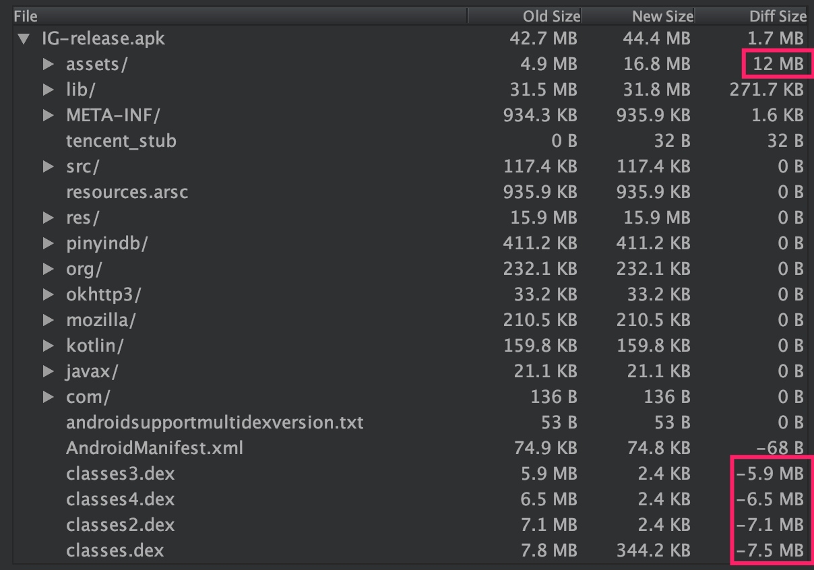

[TOC]

自测题：

+ **tinker 是如何更新 so 的?**

# Tinker

+ 核心原理
    + dex 加载顺序
    + diff 算法和 dex 差分包
+ 关键类
    + DexClassLoader
    + DexPathList

关键代码：

```java
    // 将 dexPath 下指定的各个 dex 文件封装成 dexElements
    this.dexElements = makeDexElements(splitDexPath(dexPath), optimizedDirectory,
                                           suppressedExceptions, definingContext);

    // 在 dexElements 中查找 class
    public Class findClass(String name, List<Throwable> suppressed) {
        for (Element element : dexElements) {
            DexFile dex = element.dexFile;

            if (dex != null) {
                Class clazz = dex.loadClassBinaryName(name, definingContext, suppressed);
                if (clazz != null) {
                    return clazz;
                }
            }
        }
        if (dexElementsSuppressedExceptions != null) {
            suppressed.addAll(Arrays.asList(dexElementsSuppressedExceptions));
        }
        return null;
    }
```

## 背景知识

`PathClassLoader`

> /**
 * Provides a simple {@link ClassLoader} implementation that operates on a list
 * of files and directories in the local file system, but does not attempt to
 * load classes from the network. Android uses this class for its system class
 * loader and for its application class loader(s).
 */

`DexClassLoader`

> /**
 * A class loader that loads classes from {@code .jar} and {@code .apk} files
 * containing a {@code classes.dex} entry. This can be used to execute code not
 * installed as part of an application.
 *
 * <p>This class loader requires an application-private, writable directory to
 * cache optimized classes. Use {@code Context.getCodeCacheDir()} to create
 * such a directory: <pre>   {@code
 *   File dexOutputDir = context.getCodeCacheDir();
 * }</pre>
 *
 * <p><strong>Do not cache optimized classes on external storage.</strong>
 * External storage does not provide access controls necessary to protect your
 * application from code injection attacks.
 */

## 延伸问题

tinker 是如何更新 so 的?


## 参考

[简单易懂的tinker热修复原理分析 - 掘金](https://juejin.im/post/5b640deef265da0f86544bb1)

# APK 加固

核心原理：主要是对 dex 文件进行加密 (除此之外还有其他一些不同的技术方案，比如代码混淆、so 文件加密)

+ 源apk：需要加密的apk程序，源dex来自于源apk
+ 壳程序：提供壳dex，壳dex 作为工程入口从加密后的dex解密出源dex
+ 加解密程序：对源dex加密，对加密后的dex解密

---




从图中可以看到，各个 classes.dex 文件从几MB减少到几KB。而对应地，`assets` 目录下多出来很多文件。

## 背景知识

dex文件是从class文件演变而来的，class文件存在冗余信息，dex文件则去掉了冗余，并且整合了整个工程的类信息。

## 参考

[浅谈安卓apk加固原理和实现_ITPUB博客](http://blog.itpub.net/31562043/viewspace-2284074/)