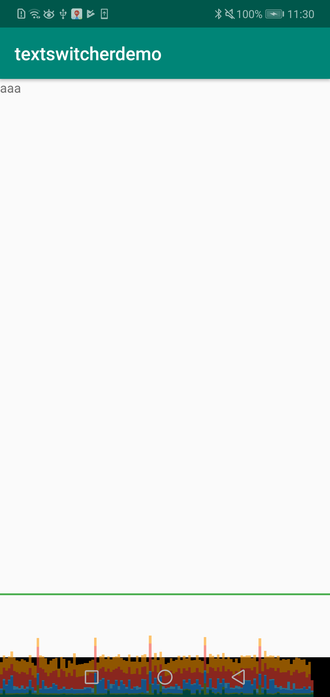
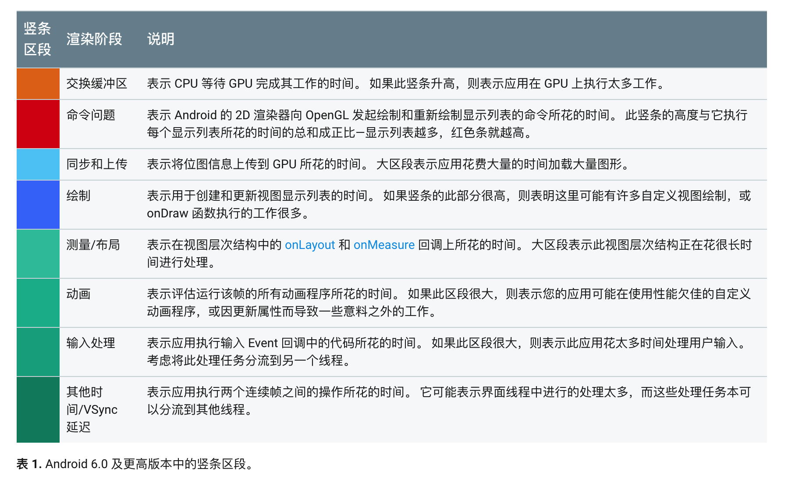
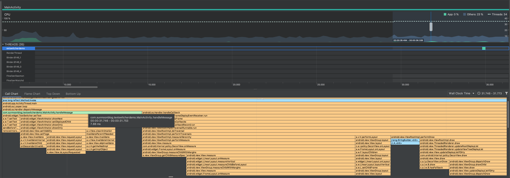
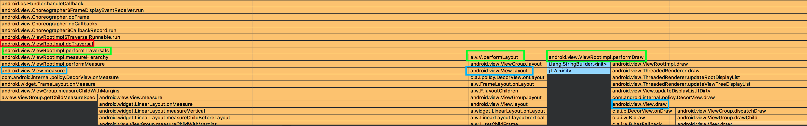

聊天 Android View 的绘制流程。从 TextSwitcher 的低性能说起。

# 问题
文字轮播时遇到性能问题。

布局如下。(实际 app 中的布局一般更为复杂，所以这里故意加几层 LinearLayout 来加深布局层级，更接近实际便于观察问题)

```xml
<?xml version="1.0" encoding="utf-8"?>
<android.support.constraint.ConstraintLayout xmlns:android="http://schemas.android.com/apk/res/android"
    xmlns:app="http://schemas.android.com/apk/res-auto"
    android:layout_width="match_parent"
    android:layout_height="match_parent">

    <LinearLayout
        android:layout_width="0dp"
        android:layout_height="0dp"
        app:layout_constraintBottom_toBottomOf="parent"
        app:layout_constraintEnd_toEndOf="parent"
        app:layout_constraintHorizontal_bias="0.5"
        app:layout_constraintStart_toStartOf="parent"
        app:layout_constraintTop_toTopOf="parent">


        <LinearLayout
            android:layout_width="match_parent"
            android:layout_height="match_parent">

            <LinearLayout
                android:layout_width="match_parent"
                android:layout_height="match_parent">

                <TextSwitcher
                    android:id="@+id/textSwitcher"
                    android:layout_width="match_parent"
                    android:layout_height="wrap_content" />

            </LinearLayout>
        </LinearLayout>

    </LinearLayout>

</android.support.constraint.ConstraintLayout>
```

```kotlin
class MainActivity : AppCompatActivity(), Handler.Callback {

    val handler = Handler(this)

    override fun handleMessage(msg: Message?): Boolean {
        if (msg?.what == 1) {
            textSwitcher.setText("aaa")
            handler.sendEmptyMessageDelayed(2, 3000)
        } else {
            textSwitcher.setText("bbb")
            handler.sendEmptyMessageDelayed(1, 3000)
        }

        return true
    }

    override fun onCreate(savedInstanceState: Bundle?) {
        super.onCreate(savedInstanceState)
        setContentView(R.layout.activity_main)

        textSwitcher.setFactory{
            TextView(this)
        }

        textSwitcher.inAnimation = AnimationUtils.loadAnimation(this, R.anim.text_switch_push_up_in)
        textSwitcher.outAnimation = AnimationUtils.loadAnimation(this, R.anim.text_switch_push_up_out)

        handler.sendEmptyMessage(1)
    }

    override fun onDestroy() {
        super.onDestroy()
        handler.removeCallbacks(null)
    }
}
```

性能如下：



从图中可以看到每隔3秒就会出现一个很高的条形图。这个条形图主要是由绿色区域导致突然变高的。

 [ref](https://developer.android.com/studio/profile/inspect-gpu-rendering)

根据官方文档我们知道绿色区域代表了  onLayout 和 onMeasure 回调的耗时。



handleMessage() 处理得很快，只需要6ms左右。但由于调用 `View.setVisibility()` 引起 `requestLayout()`，导致整个界面重新布局。

# how android draw views

[How Android Draws Views  |  Android Developers](https://developer.android.com/guide/topics/ui/how-android-draws)

文档中说得比较简单。




结合上面这个图看会很直观：

+ android.view.ViewRootImpl.doTraversal()
  + android.view.ViewRootImpl.measureHierarchy()
    + android.view.View.measure()
  + android.view.ViewRootImpl.performLayout()
    + android.view.View.layout()
  + android.view.ViewRootImpl.performDraw()
    + android.view.View.draw()

> When an Activity receives focus, it will be requested to draw its layout. The Android framework will handle the procedure for drawing, but the Activity must provide the root node of its layout hierarchy.

+ 谁是 Android framework ？- 可以理解为上图中的 `android.view.Choreographer.doFrame()`
+ 谁是 the root node of its layout hierarchy ？ - 可以简单地理解为 `Activity.setContentView()` 中传进入的那个 View (当然实际上它并不是真正的 root node)

#


---


ListView 的 ViewHolder模式。它的优点：

+ 减少 View 的创建
+ 减少 `findViewById()` 的调用

减少View。常见的策略包括：

+ `TextView` 和 `ImageView` 合并
+ 使用custom state。例子见[view-reduction](https://sriramramani.wordpress.com/2013/03/25/view-reduction/)，这个例子将一个复杂布局优化成只使用一个 `TextView`


