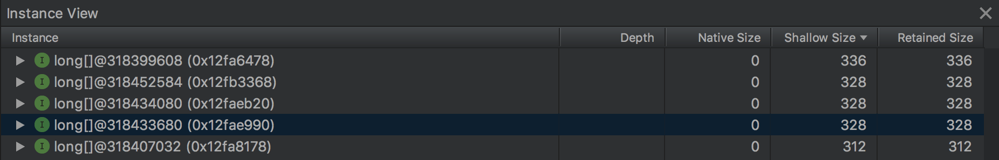
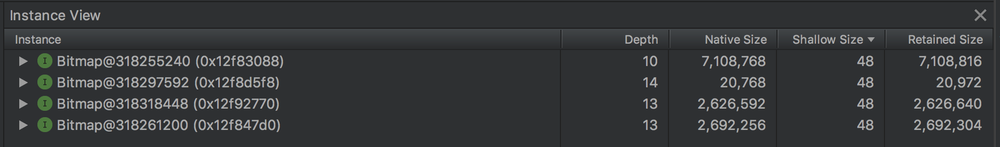
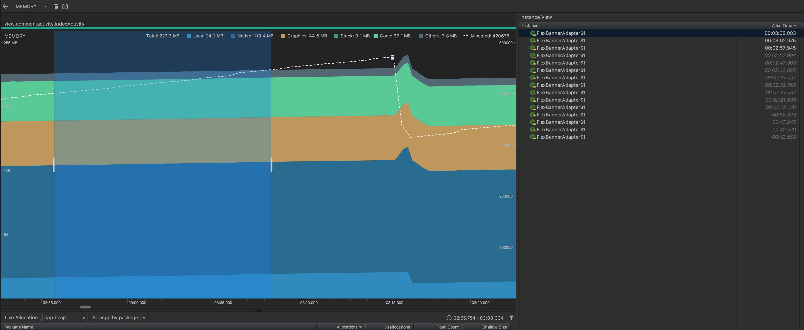
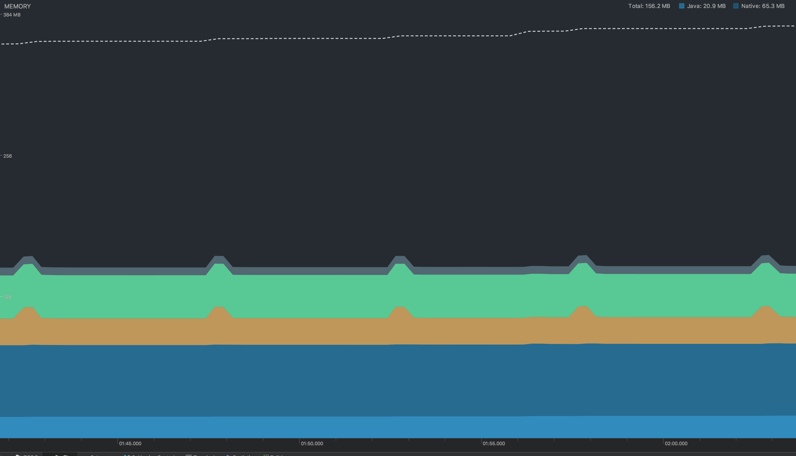
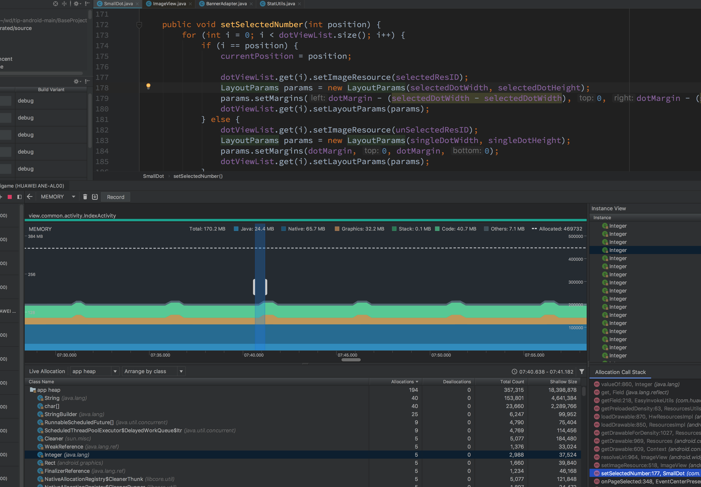

关于Bitmap的小知识 [ref](https://developer.android.com/topic/performance/graphics/manage-memory)

To set the stage for this lesson, here is how Android's management of bitmap memory has evolved:

+ On Android Android 2.2 (API level 8) and lower, when garbage collection occurs, your app's threads get stopped. This causes a lag that can degrade performance. Android 2.3 adds concurrent garbage collection, which means that the memory is reclaimed soon after a bitmap is no longer referenced.
+ On Android 2.3.3 (API level 10) and lower, the backing pixel data for a bitmap is stored in native memory. It is separate from the bitmap itself, which is stored in the Dalvik heap. The pixel data in native memory is not released in a predictable manner, potentially causing an application to briefly exceed its memory limits and crash. From Android 3.0 (API level 11) through Android 7.1 (API level 25), the pixel data is stored on the Dalvik heap along with the associated bitmap. In Android 8.0 (API level 26), and higher, the bitmap pixel data is stored in the native heap.

---

关于 `View.invalidate()` 的小知识

`public void invalidate(int l, int t, int r, int b)`被废弃了。The switch to hardware accelerated rendering in API 14 reduced the importance of the dirty rectangle. In API 21 the given rectangle is ignored entirely in favor of an internally-calculated area instead. Because of this, clients are encouraged to just call {@link #invalidate()}.

---

关于 Glide 的小知识

```
D/MemorySizeCalculator: Calculated memory cache size: 18.58 MB pool size: 37.15 MB memory class limited? false max size: 161 MB memoryClass: 384 isLowMemoryDevice: false
```

几个关键值 

+ memory cache size - 18.58MB
+ pool size - 37.15MB

---

关于 shallow size 和 retained size

shallow size 可理解为浅层大小，即对象自身占用的内存大小。 

+ 数组的 shallow size 由数组大小及数组元素类型决定
+ 一个对象集的 shallow size 是对象集中每个对象的 shallow size 和



retained size 可理解为保留大小，即对象本身的 shallow size 加上所有可达对象的 shallow size。换句话说就是对象本身连同其无法从 GC 根到达的相关对象一起删除后释放的内存大小。

native size 某些对象的实际数据并不是分配在Java堆上而是分配在 C 或 C++ 中分配，所以还能看到 native size 不为0



[ref](https://developers.google.com/web/tools/chrome-devtools/memory-problems/memory-101?hl=zh-cn)

[ref2](https://www.yourkit.com/docs/java/help/sizes.jsp)

[ref3](https://help.eclipse.org/mars/index.jsp?topic=%2Forg.eclipse.mat.ui.help%2Fconcepts%2Fshallowretainedheap.html)

---


在 Android Studio Profiler 中发现 app 在前台静置时，也一直在创建对象，内存缓慢上升。随之而来发生一次GC



见图片中虚线

Allocated 从 401459 上升到 447244，定位到我们自己的java package，Profiler显示这段时间一共创建了3个 `FlexBannerAdapter$1` 对象。`FlexBannerAdapter$1`对象的创建时间很有意义，大约是每隔5秒创建一个。


联想到app首页的广告位5秒轮播一次，很快就定位到可疑代码。`FlexBannerAdapter$1` 对象正是这里的匿名 `View.OnClickListener`。 

```java
public class FlexBannerAdapter extends PagerAdapter {

    @Override
    public void destroyItem(ViewGroup container, int position, Object object) {
        // NO OP
    }

    @Override
    public Object instantiateItem(ViewGroup container, int position) {
        ...
        View view = activity.getLayoutInflater().inflate(R.layout.abclayout, container, false);
        view.setOnClickListener(new View.OnClickListener() {}
        ...
    }
}
```

这段代码有两个问题：

+ `destroyItem()` 是空的，没有任何清理操作
+ `instantiateItem()` 不够优化，每次都重新创建 View 对象

??? 上述问题没有复现。

---

观察内存前关闭

+ StrictMode
+ Stetho
+ 关闭测试环境log实时上报 StatUtils.startApp 
+ 关闭MAT debug开关
+ 关闭循环内存上报  LooperMonitor

---

首页第一个tab，静置时每5秒gc一次。

原因：广告位5s轮播一次，每次轮播后进行一次MTA统计

```
viewPager.addOnPageChangeListener {
    @Override
    public void onPageSelected(int i) {
        i = i % mBannerAdapter.getRealCount();
        // 记录曝光次数
        mta() 
    }
}
```

每调用`mta()`一次就gc一次！



---

自定义控件效率不高的问题



场景：每5秒轮播一次

+ 每5秒向Handler发一个消息
+ 收到消息时调用`ViewPager.setCurrentItem()`
+ `OnPageChangeListener.onPageSelected()`方法被回调
+ `Small.setSelectedNumber()`方法被调用

```java
    public void setSelectedNumber(int position) {
        for (int i = 0; i < dotViewList.size(); i++) {
            if (i == position) {
                currentPosition = position;

                dotViewList.get(i).setImageResource(selectedResID);
                LayoutParams params = new LayoutParams(selectedDotWidth, selectedDotHeight);
                params.setMargins(dotMargin - (selectedDotWidth - selectedDotWidth), 0, dotMargin - (selectedDotWidth - selectedDotWidth), 0);
                dotViewList.get(i).setLayoutParams(params);
            } else {
                dotViewList.get(i).setImageResource(unSelectedResID);
                LayoutParams params = new LayoutParams(singleDotWidth, singleDotHeight);
                params.setMargins(dotMargin, 0, dotMargin, 0);
                dotViewList.get(i).setLayoutParams(params);
            }
        }
    }
```

```java
    public void setLayoutParams(ViewGroup.LayoutParams params) {
        if (params == null) {
            throw new NullPointerException("Layout parameters cannot be null");
        }
        mLayoutParams = params;
        resolveLayoutParams();
        if (mParent instanceof ViewGroup) {
            ((ViewGroup) mParent).onSetLayoutParams(this, params);
        }
        requestLayout();
    }
```

+ 优先使用 `Drawable` 而不是 `resId`
+ 避免调用 `set`

---

某 `Fragment` 动画没有及时停止

```java
    private void animateRadarView() {
        controllerZoom = Technique.ZOOM_IN.playOn(radarView);
        controllerFade = Technique.ZOOM_FADE_OUT.getComposer().onEnd(new Technique.AnimatorCallback() {
            @Override
            public void call(Technique.SimpleAnimator animator) {
                animateRadarView();
            }
        }).playOn(radarView);
    }
```

CPU 一直有轻微占用, 对应的 Fragment 和 Activity 内存泄漏


`ViewPager` 中的 Fragment 如何优雅地停止或重启某些操作？

---

应用有三个进程。应当只为主进程初始化weex模块。


QALSERVICE 进程和 QALSERVICE 进程均减少 1.5MB 左右内存。具体做法是在 
 `Application.onCreate()` 方法中判断当前进程，只为主进程初始化weex


优化前：


```
** MEMINFO in pid 12113 [:QALSERVICE] **

App Summary
                       Pss(KB)
                        ------
           Java Heap:     3896
         Native Heap:     3464
                Code:      368
               Stack:       32
            Graphics:        0
       Private Other:     2572
              System:     4088

               TOTAL:    14420       TOTAL SWAP PSS:       87
```

```
** MEMINFO in pid 12174 [:NSFService] **

 App Summary
                       Pss(KB)
                        ------
           Java Heap:     4044
         Native Heap:     2904
                Code:      272
               Stack:       32
            Graphics:        0
       Private Other:     2420
              System:     4648

               TOTAL:    14320       TOTAL SWAP PSS:       87
```

优化后

```

** MEMINFO in pid 12844 [:NSFService] **

 App Summary
                       Pss(KB)
                        ------
           Java Heap:     4436
         Native Heap:     2932
                Code:      308
               Stack:       32
            Graphics:        0
       Private Other:     2912
              System:     5076

               TOTAL:    15696       TOTAL SWAP PSS:       87
```

```

** MEMINFO in pid 12790 [:QALSERVICE] **


 App Summary
                       Pss(KB)
                        ------
           Java Heap:     4196
         Native Heap:     3600
                Code:      392
               Stack:       32
            Graphics:        0
       Private Other:     2804
              System:     4811

               TOTAL:    15835       TOTAL SWAP PSS:       87
```

---


Android 8.0, Glide 3.7, Native heap 超过100MB，占比最大。原因？


