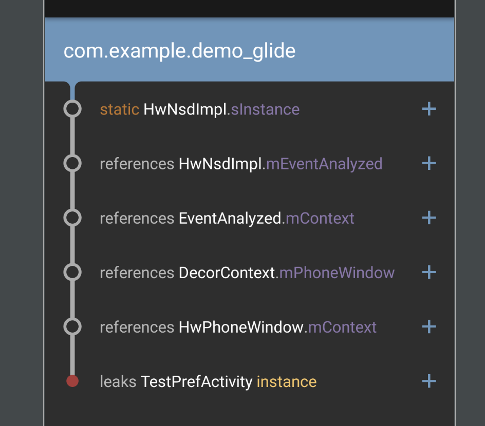
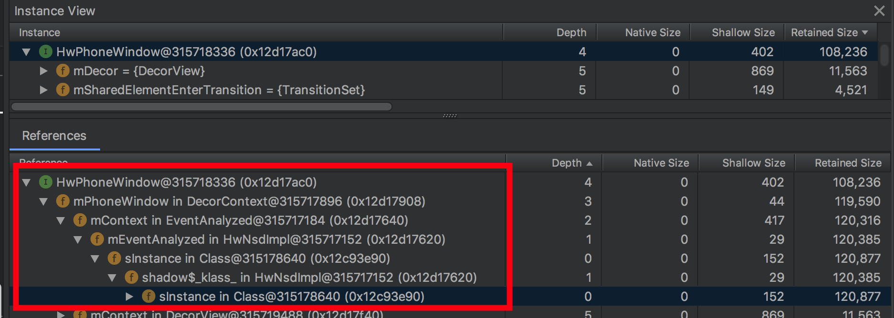
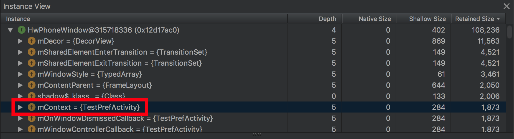

对 app 做内存分析时发现在华为 nova 3e 手机上首页会出现内存泄漏。LeakCanary 和 Android Studio Profiler 均能测出这里的内存泄漏，但给出引用链关系不太容易看明白。所以无法找到原因。

于是写了一个只有一个 Activity 的简单 demo 进行测试。这一回结果很明显了。

# LeakCanary 的测试结果

LeakCanary 的测试结果非常明显

# Android Studio Profiler 的测试结果
再来拿 Android Studio Profiler 进行对比测试。操作步骤如下：

1. back 键退出应用
2. Profiler 中强制 GC
3. 等待足够长的时间后 dump heap
4. 对 heap 进行分析

上图表明某个静态字段最终引用到了 `HwPhoneWindow` 实例

上图表明 `HwPhoneWindow.mContext` 引用了 `TestPrefActivity` 实例

于是 `TestPrefActivity` 最终发生泄漏。

总结一下：这个案例符合**被静态字段引用导致内存泄漏**的情形。但直接在较大 app 中分析对象之间的引用关系还是比较麻烦的，尤其是可能由于系统本身引起内存泄漏问题时。所以这时建议不妨使用简单 demo 进行验证。

[demo 源码](https://gist.github.com/410063005/4501131fa2abcc26cce1ef81b2026176)
