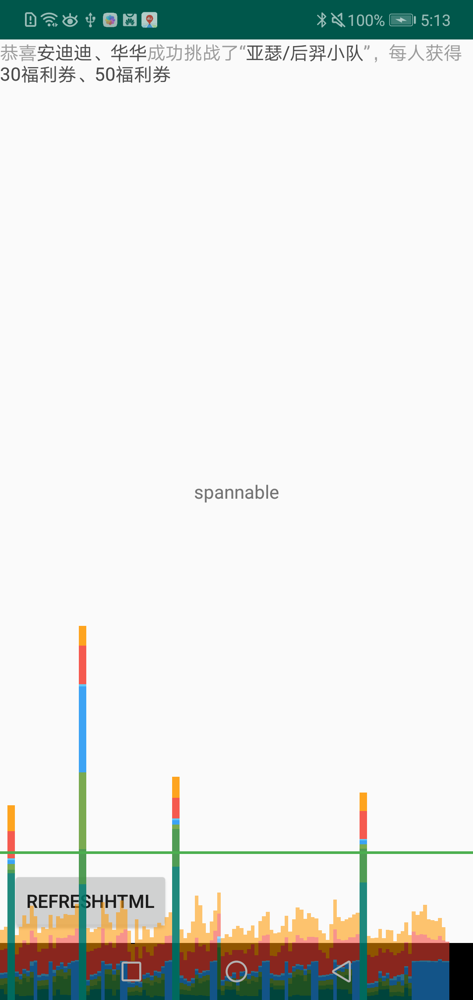

```
textHtml.setText(Html.fromHtml("<font color=\"#9b9b9b\">恭喜</font><font color=\"#4A4A4A\">安迪迪、华华</font><font color=\"#9b9b9b\">成功挑战了“</font><font color=\"#4A4A4A\">亚瑟/后羿小队</font><font color=\"#9b9b9b\">”，每人获得</font><font color=\"#4A4A4A\">30福利券、50福利券</font>"))
```





