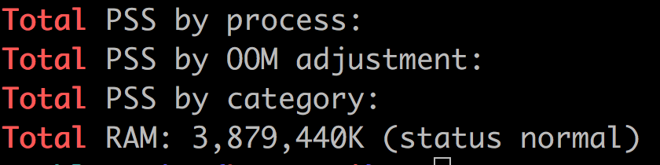
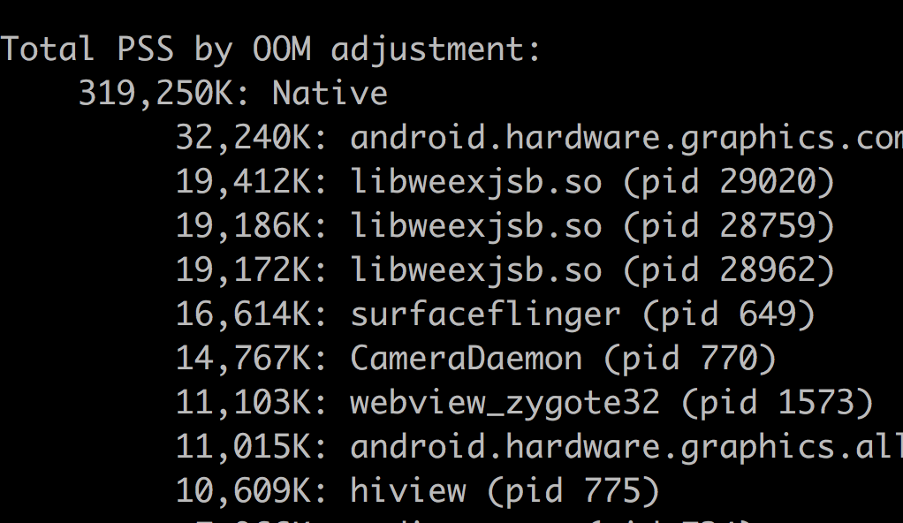
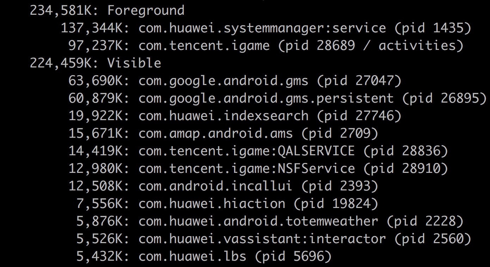
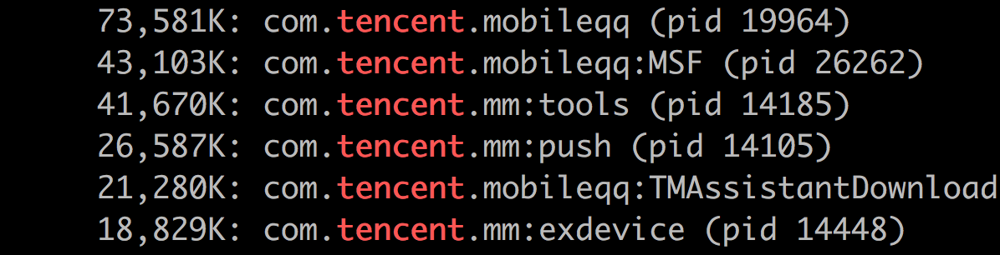

关于进程的几个问题。

# 如何区分 native 进程和应用进程

`adb shell dumpsys meminfo` 命令输出结果中区分不同的 Category。

`Total PSS by OOM adjustment` 中有列出哪些是 Native 进程。所以可以使用 `adb shell dumpsys meminfo` 找出 native 进程。

结果类似这样：

# 如何区分前台进程和后台进程

使用 `adb shell dumpsys meminfo` 也很容易找到哪些是前台进程

# user与pid的区别，同一包名下有两个进程时会是什么现象

同一包名下允许多个进程，现在很多 app 是这样干的。如下图。

# 如何查看app的进程

使用 `adb shell dumpsys meminfo` 命令

# 连续开启几个app后同学我来了就被杀?

内存利用效率不高。可能原因是没有使用 `onTrimMemory()` 来控制内存峰值。