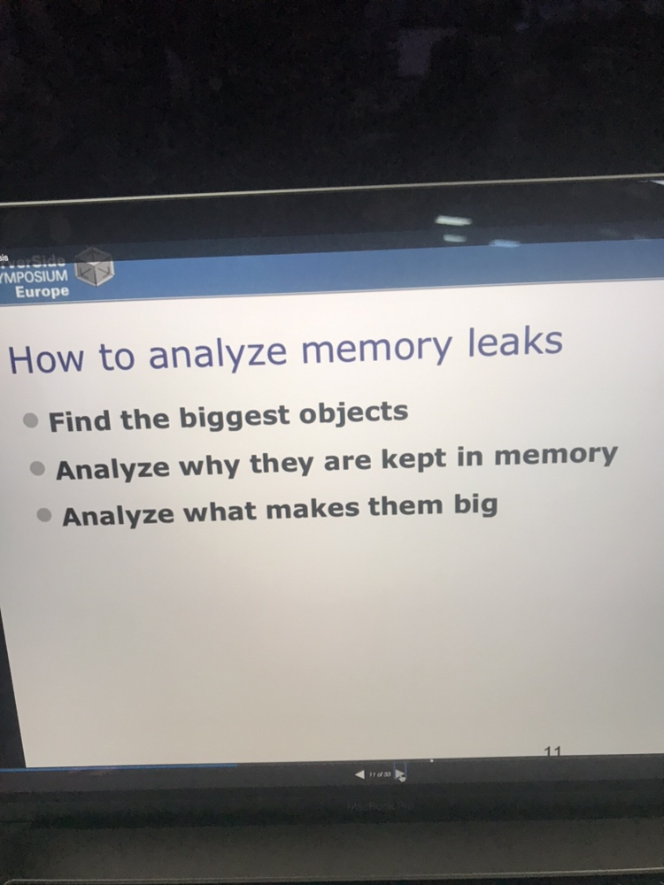
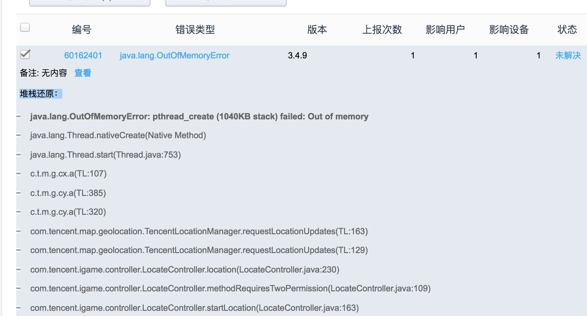

# 经验

[#](https://developer.android.com/topic/performance/rendering/optimizing-view-hierarchies)

[10 条提升 Android 性能的建议](https://academy.realm.io/cn/posts/droidcon-farber-improving-android-app-performance/)

[Android性能优化实践 - 掘金](https://juejin.im/post/5cebc989e51d454f72302482#heading-11)

某项目内存相关的疑问

+ 疑点: 汉语拼音库的使用占用 2MB 内存
+ 疑点: 汉语拼音库在主线程中使用
+ 疑点: 动画导致内存泄露
+ 问题: 频繁被杀，内存抖动引起卡顿
+ 问题: 快速找出大对象，找出相似图片，找出大量分配(网络底层代码)，
+ 问题: 框架优化，利用空页面
+ 问题: 栈问存溢出
+ 问题: 旧代码
+ 问题: 重复对象
+ 问题: 缓存 hashmap
+ 问题 leakcanary 监听dialog
+ 问题 如何收拢 bitmap创建过程
+ 问题 [android 8.0 变更对 Glide 库的影响](https://stackoverflow.com/questions/48091403/how-does-bitmap-allocation-work-on-oreo-and-how-to-investigate-their-memory)

# 优化

## 内存

内存分析的一点以经验

### OOM

[不可思议的OOM - Android - 掘金](https://juejin.im/entry/59f7ea06f265da43143ffee4)

> 创建过多线程导致的 OOM

[栈内存溢出: java.lang.OutOfMemoryError: pthread_create (1040KB stack) failed: Out of memory - 简书](https://www.jianshu.com/p/8dc59bd01a26)

>  java.lang.OutOfMemoryError: pthread_create (1040KB stack) failed: Out of memory

[由一个stack OOM引发的血案 - oscaryue的专栏 - CSDN博客](https://blog.csdn.net/oscaryue/article/details/72967448)

相关知识点:

+ 线程的创建
+ 线程数量上限
+ 用户地址空间

## 速度

# 工具

+ [systrace]()
    + 如何诊断app的磁盘活动，有没有例子?
+ mat
    + 使用案例 [我这样减少了26.5M Java内存！ - 腾讯WeTest](https://wetest.qq.com/lab/view/359.html?from=coop_gad)
    + 用法 见文末
+ lint
+ leakcanary
+ matrix 和 haha
+ Debug 类及 `dumpsys` 命令 [内存优化－内存分布 - 简书](https://www.jianshu.com/p/11223abadf6f)
+ Android Studio 内存分析工具 [Memory Profiler使用](https://www.jianshu.com/p/e75680772375)
# 其他

[Android Advance With Geektime 极客时间](https://github.com/AndroidAdvanceWithGeektime)

# 参考

## mat 用法指南

+ https://www.eclipse.org/mat/documentation/
+ https://wiki.eclipse.org/MemoryAnalyzer/FAQ
+ https://wiki.eclipse.org/MemoryAnalyzer/Learning_Material
+ https://www.ibm.com/support/knowledgecenter/en/SS3KLZ/com.ibm.java.diagnostics.memory.analyzer.doc/shallowretainedheap.html
+ https://wetest.qq.com/lab/view/359.html?from=coop_gad
+ https://wetest.qq.com/lab/view/362.html