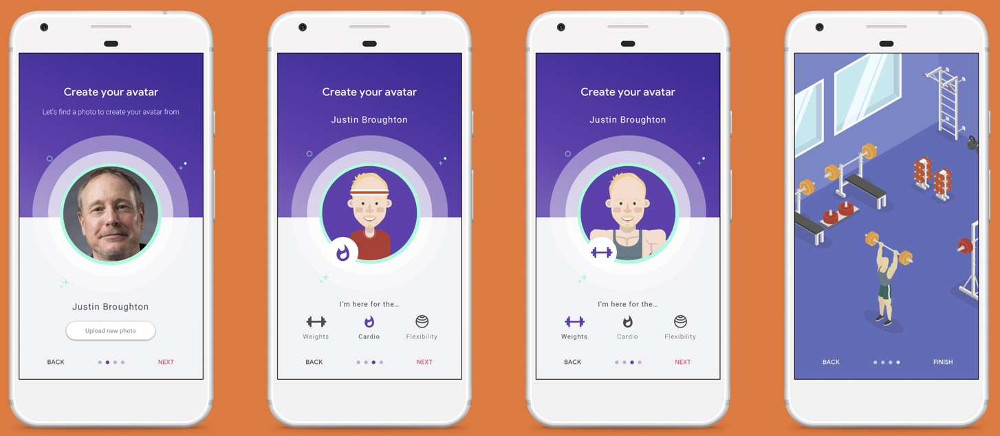

# (译) Google Play expands its pre-launch testing capabilities

本文翻译自 [Google Play expands its pre-launch testing capabilities](https://medium.com/googleplaydev/google-play-expands-its-pre-launch-testing-capabilities-9b51a23077cf)

自测题：

+ 这里的 Robo 到底是什么
+ 了解 AirTest
+ 了解 Espresso
+ 了解 UI Automator
+ 什么是 deep link
+ Espresso Test Recorder
+ 
---

测试是游戏或应用达到高质量的一个关键。但是它经常也是开发工作中最耗时最让人受挫的工作之一。作为 Google 的产品经理，我知道理解测试带来的挑战非常重要。所以我们在 Google Play Console 和 Firebase Test Lab 中开发了一些新的功能，用来减少开发人员的在测试上遇到的困难。好在现在基本测试只要很少的工作，而更多的高级测试工具让你花的时间更少，让你能聚集于最擅长的工作：开发优秀的应用和游戏。

本文将介绍 Google Play Console pre-launch report 以及 Firebase Test Lab 的一些新功能。本文基于一个虚构的健身应用来说明这些功能。这个应用中，用户可以注册、登录、上传头像、邀请好友锻炼、加入当地健身房、设置目标以及监督目标。

# Pre-launch report

Google Play Console pre-launch report 用于为发布到 Google Play Console 的预发布应用提供质量问题相关的早期警告。这个报告基于利用 Firebase Test Lab 提供的工具和基础设施在各种真机上的自动测试。测试设备包括从 Google Pixel 2 这样的高端机到 Samsung Galaxy J1 这样的低端机型。测试由 crawler (我们称之为 Robo) 来完成，它像用户使用应用那样向应用输入各种事件。

测试完成后，pre-launch report 将展示应用中存在的问题，比如崩溃、安全漏洞、启动时间。它还为每个界面截图以便检查 UX 问题。

为了方便调试问题，可以回放每台设备上的测试录屏检查 Robo 的具体行为。当你检查网络、内存以及 CPU 性能数据时，视频可以与数据图表的时间线同步，以帮助检查崩溃或掉帧发生在哪里。对于崩溃，可以看到栈帧。还可以查看每次测试的完整的 logcat 日志。

Pre-launch report 开箱即用，对应用或 SDK 完全无入侵。

# A new overview

很多开发者面对的一个挑战时有太多应用健康和性能相关的性能，但不知如何考虑报告出的问题的优先级。为此，Google Play 发布了一个新的页面展示所有已发现的问题。

这款健身应用最新版本的报告如上图，页面顶部可以看到一个简单清晰的修改建议。这个案例中，发现了崩溃、性能和可访问性问题，给出的建议是修复崩溃并在发布这个版本前前检查警告。这之后的表格则列出了问题的优先级。

# Demo loops and monkey actions

聪明的 Robo crawler 让 pre-launch report 更为强大，而 Firebase Test Lab  则为检查应用的 Android framework 部分做了出色的工作。但像很多应用一样，我们这个健身应用也用到了 OpenGL，OpenGL 用于创建头像等功能。之前，crawler 并不能测试使用了 OpenGL 的应用或游戏，现在则新加了几种方式用于处理应用中使用了 OpenGL 功能的部分。

为了让 crawler 能测试游戏，可以编写一个或多个 demo loops。Demo loops 可以是游戏中的聚集于一个游戏级别或角色的某些自动化路径。Demo loops 在 manifest 中声明，并且在 crawl 的初始阶段被触发，但不会在正常的使用中被触发。一旦 crawler 启动 demo loops，就可以获取到渲染方面的标准测试结果，可用于分析帧率相关的任何问题。

但是，如果不使用 demo loops，pre-launch report 将使用 monkey actions。crawler 检测到应用或游戏的 OpenGL canvas 时，它将开始使用随机事件。虽然 monkey actions 并不像 demo loop 那样精确，但同样也可检查出某些未能发现的问题。这些功能一起为朝向有意义地游戏自动化测试迈出了重要的一步。

# Getting behind the sign in

这个假想应用的开发者想保证用户数据安全，所以使用了自定义登录或 Google Sign-In。当 crawler 看到 Google Sign-In 时，它使用测试设备上的 Google 账户登录。如果应用不使用 Google Sign-In，则要为 pre-launch report 配置测试账号用户名和密码，以便 crawler 遇到登录界面时能使用这些数据自动登录。

# Digging into deep links

Deep links 可以绕开正常流程来调用应用内的功能。比如，有人可能在 web 上搜索并沿着 结果中的 deep link 进入到应用中的相应界面。

这个健身应用使用 deep links，鼓励人们注册到当地健身房。应用的这一场景中，该流程是通过向用户发送 Firebase 通知来实现的。当用户点击通知中的 deep link 时直接进入到 gym 应用(译者：这里指的应该是当地健身房的 app)的注册界面。这个流程很重要因为 money changes hands，而且每次发版时都应当被测试到 (原文：This flow is very important because money changes hands and so should be tested in every release)

使用最新的 pre-launch report，最多可以测试三个 deep links。crawler 像往常一样工作5分钟，然后关闭应用，访问每个 deep link。这个额外 crawl 过程中发现的任何问题也会放在报告中。

# Extra control from Robo scripts

应用中的一些重要部分有时只能通过一些复杂流程到达，比如这个健身应用的 gym 注册表单界面。crawler (甚至某些人) 并不擅长输出正确的文本来通过这个界面。

Robo 脚本用于指导 crawler 通过应用中的复杂路径。它们还可用于保证 crawler 按某个特定的路径来访问应用。Robo 脚本将这种形式的一系列动作录制成 JSON 文件。可以使用 Android Studio 的内置工具来录制脚本。应用在本地运行时，你录制一系列 taps, swipes 和 text input。然后将录制完成的脚本上传到 pre-launch report。这些脚本用于指导 crawl 过程如何开始，让应用进入到某种你可以开始测试的状态。一旦 Robo 脚本运行完成，crawler 按正常方式工作。

# Usability and accessibility

pre-launch report 现在也能发现可访问性和可用性问题，比如过小的点击目标、对比度问题和 voice-over annotations

很多人在使用应用时都会遇到点击目标过小的的问题，包括单手使用应用或手指不够灵巧的人。良好的对比度可以保证文字清晰，这非常重要，对视力有障碍的人尤其重要。一些有视力障碍的人依赖 TalkBack，所以也会报告 TalkBack voiceover annotations 缺失的问题。

# Pre-launch report as a launch decision tool

开发者告诉我们他们很看中 pre-launch report。最近的调查显示 86% 的人认为在决定是否打开新应用时 pre-launch report 重要或是非常重要。当开发者忽略报告的建议时，其中发现的崩溃很可能未来会被真实用户发现。遇到崩溃的用户体验非常糟糕，他们会留下很差的评价，倾向于不在这个应用上花钱，或是直接卸载。

pre-launch report 是 Google Play Console 中的标准功能，对每个向 testing tracks (即之前的 alpha 和 beta 版本) 发布应用的开发者来说都是免费的。你能在 
‘Manage Releases’ 下的 Google Play Console 中找到它。

# Do more in Firebase Test Lab

当你将应用上传到 Google Play 时，pre-launch report 帮助找到应用中影响用户使用的问题。但你可能想在开发阶段找到更多的问题，因为问题越早发现越容易修复，且修复成本越低。Firebase Test Lab 可以帮你更快地做到这一点。

如果你 [sign up for Firebase Test Lab](https://firebase.google.com/docs/test-lab/)，你可以使用更强大的工具，以及覆盖范围更广的设备，还能编写 instrumentation test。比如说，你可以跟若干开发工作集成，比如 Android Studio、Fastlane、Google Cloud SDK，以及 Firebase Console。这些工具让你可以在应用开发过程中的任何阶段使用更多的设备来测试应用和游戏，得到更全面的测试结果。

但是，如我们所知，创建和维护测试也很困难。因此我们寻求如何改进自动化测试。

# OpenGL testing

我们的健身应用中会创建用户头像。这个过程涉及到上传照片，并基于这个照片生成漫画头像。之后当用户选择当前聚集的某个活动，比如重量练习，漫画头像的风格也会跟着更新。

People using the app then guide their avatar around the gym activities as they work on their fitness.

这里说到的头像是使用 OpenGL 开发的。之前很难测试使用 OpenGL 开发的应用和游戏，但 Firebase Test Lab 现在引入了一些方法让这类测试变得简单很多。第一种方式是前面提到的 demo loop，目前已添加到 Google Play Console pre-launch report。在 Firebase Test Lab 中也可以运行类似的 demo loop，并且使用到的设备更丰富。

为了进一步探索游戏测试 Firebase 跟中国最大的游戏开发商之一，网易，合作开发可在 Firebase Test Lab 运行的游戏测试。这个合作的一部分成果是网易开源了他们的测试环境，AirTest，以及他们用于开发测试的部分框架。使用这些框架，你可以向游戏元素添加动作和断言，包括触摸某个游戏元素，或者等待某个游戏元素变得可见，或者断言某个游戏元素当前可见。

使用 demo loop，这些测试既可以在本地运行，也可以在 Firebase Test Lab 运行。

# Instrumentation tests

我们的应用包含一个创建目标的界面，用户可以在这里创建目标，并且分享给好友。这部分使用 Android framework 开发。通常，为这类界面开发测试涉及到使用一种或多种测试框架来进行艰苦的手工测试(译者注：使用这些测试框架写测试代码)，比如 Espresso 或 UI Automator，然后保证测试代码跟 UI 同步演进。

Espresso Test Recorder 是 Android Studio 的一部分，可以通过跟本地设备上运行的应用交互来快速录制 Espresso 测试，简化上述测试过程。除了录制动作，还可以对任何屏幕元素添加断言。这些测试代码使用 Java 或 Kotlin。

现在，如果你的 UI 变化了，只用简单地重新录制测试。

Espresso Test Recorder 可以模块化测试。你可以为常用的功能创建测试片断，比如登录、填写搜索框。通过这种方法你可以轻易地为应用创建一系列测试。

# The more devices, the better

应用需要在各种设备上运行良好。如何保证应用在所有设备上运行良好？Pre-launch report 提供免费的 crawler testing，这个测试在10台性能和系统版本不同的设备上运行。你在 Firebase Test Lab 上可以使用更多的设备，包括更多的屏幕尺寸、API 版本、OEM 以及芯片。

# Testing locally to go global

我们的健身应用在全球发布，因此需要针对不同的语言进行测试。Firebase Test Lab 和 Google Play Console 都支持这种测试。通过 Firebase Test Lab 可以在任意期望的地区/语言下测试，而 pre-launch report  自动在最流行的语言下测试。

# Test results

Firebase Test Lab 提供全面的测试结果，包括崩溃、ANR、录屏、截屏、日志、性能测试等。

录屏和截屏功能特别重要，可以帮助设计团队确认应用视觉良好，并且在所有屏幕尺寸、方向、locale 上都正确显示。 Firebase Test Lab 和 Google Play Console 两个产品中的 performance tab 都可以看到 CPU 尖峰或掉帧时应用的行为。

Pre-launch report 由 Play Console 为所有发布到 test tracks 应用免费生成。To get started for free on Firebase Test Lab, use the Firebase Spark billing tier

# Final word

至此，全面测试简单多了。

Pre-launch report 帮助发现崩溃、性能问题、安全漏洞、体验问题以及可用性问题。你不用进行任何配置：向 Google Play Console’s pre-production testing tracks 发布一个 APK 即可生成报告。你还可以提供自定义登录凭证、Robo 脚本、deep link、demo loop 来更好地测试。

如果想更频繁更全面地测试，Firebase Test Lab 支持在更多设备上测试，可以从自己的 CI 系统运行测试。想要了解更多关于 pre-launch testing 的话，可以看 [the session from I/O 2018](https://www.youtube.com/watch?v=zTy-ur1Wnq4&list=PLWz5rJ2EKKc9Gq6FEnSXClhYkWAStbwlC&index=43)。

# What do you think?

关于 pre-launch testing 你有什么想法？本文评论区中或 tweet 上发表 #AskPlayDev 主题的评论，我们会从 [@GooglePlayDev](https://twitter.com/googleplaydev) 回复你。