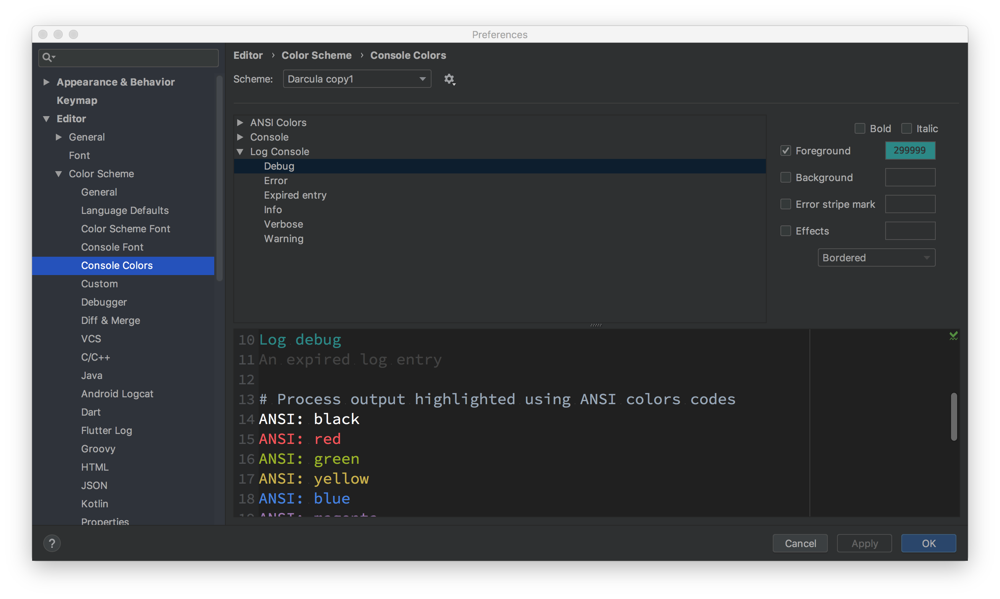
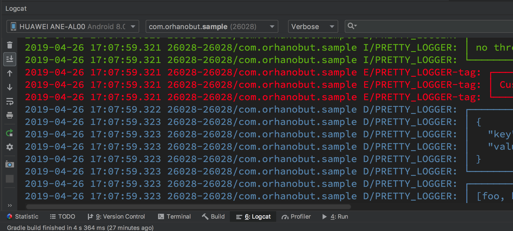

# Android
## logcat 颜色

打开 Android Studio Preference 搜索 logcat。可以看到 logcat 对不同日志级别的配色。缺省只有红白两种颜色。我们可以配置得更丰富一些。



以下是一个推荐的配置方案。

```
Debug : 6897BB 
Info : 6A8759 
Warn : BBB529 
Error : FF6B68 
Assert : 9876AA
```

