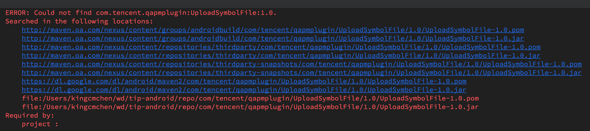

项目使用了一个私有的库(没有提交到中央库)作为依赖，同事机器编译正常，我的机器上无法编译。错误如下：



依赖配置是这样的：私有库放在 `xxx-android/repo` 目录下，将该目录配置成 maven 库。

```groovy
buildscript {
    repositories {
        ...
        maven {url uri('../xxx-android/repo')}        
    }
```

解决办法是[Install it into my .m2 folder](https://www.eviltester.com/2017/10/maven-local-dependencies.html)。步骤如下：

先执行 `mvn install` 将 jar 安装到本地 `.m2` 目录。

如果没有 `pom.xml` 文件，执行以下命令：

```
mvn install:install-file \
-Dfile=xxx.jar
-DgroupId=com.xxx.qapmplugin
-DartifactId=UploadSymbolFile
-Dversion=1.0 -Dpackaging=jar
```

如果有 `pom.xml` 文件，执行以下命令：

```
mvn install:install-file \
-Dfile=xxx.jar \
-DpomFile=pom.xml
```

安装成功后提示如下：

```
[INFO] Installing /var/folders/1v/lspfl1451p77tpwh9_qvrzkr0000gn/T/mvninstall8100119543416056253.pom to /Users/xxx/.m2/repository/com/xxx/qapmplugin/UploadSymbolFile/1.0/UploadSymbolFile-1.0.pom
```

配置本地 maven 库后就能正常引用 `xxx.jar` 了。

```groovy
buildscript {
    repositories {
        mavenLocal()
    }
}
```

如何引用另一个 gradle 文件

```groovy
apply from 'other.gradle'
```