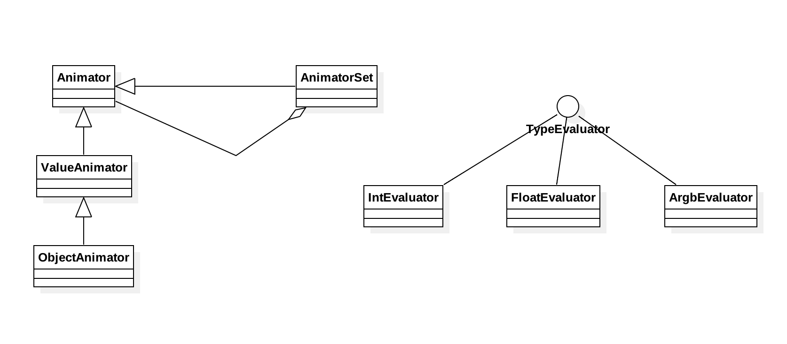

# 理解property animation

property animation包括以下属性：

+ duration - 动画持续时间。默认为300ms
+ time interpolation - 指定如何根据动画的当前时间来计算属性值
+ repeat count & behavior - 指定动画结束后是否重复，重复次数，以及重复方式
+ animator sets - 将多个动画分为一组
+ frame refresh rate - 帧刷新率。指定动画帧的刷新率，默认是10ms刷新一次。(最终刷新率以系统为准)

## 工作原理


上图显示了是如何计算`ValueAnimator`的。

+ `ValueAnimator`对象记录了动画运行时间，以及属性当前的值。
+ `ValueAnimator`封装了`TimeInterpolator`以及`TypeEvaluator`，interpolator用于定义动画插值，evaluator用于定义如何计算属性值。
+ 为`ValueAnimator`指定属性的起始值，结束值以及持续时间后调用`start()`启动动画
+ `ValueAnimator`基于'the duration of the animation'和'how much time has elapsed'计算*elapsed fraction* (介于0和1)
+ `TimeInterpolator`基于*elapsed fraction*计算*interpolated fraction*
+ `TypeEvaluator`基于属性起始值，结束值以及*interpolated fraction*计算属性当前值

## 与view animation的区别

+ view动画的限制： view动画只能用于`View`对象，用于非`View`对象时只能自己另写代码。view动画只能使用`View`对象的少量属性，比如缩放和旋转等等，但不能使用背景色等其他属性。
+ view动画的缺点： view动画只是修改了View的绘制位置，而不是View本身。所以使用view动画移动了button后，看起来button的位置变化了，但实际可点击的位置并未改变。

property动画没有上述限制和缺点。它可以用于`View`对象和非`View`对象，而且会真的修改对象本身。

不过view动画代码量少且简单，如果view动画能满足要求就没必要使用property动画。当然也可以视情况混使用view动画和property动画。

## API

property动画有两方面：一是计算动画值，二是将值设置到对象。`ValueAnimator`负责第一项，而第二项是开发者自己完成(通过监听方式获取到已计算好的动画值)

evaluator从animator获取时间值，根据时间值计算属性值。

使用int, float, 以及颜色值以外的type时需要实现自己的`TypeEvaluator`。

`ObjectAnimator`是`ValueAnimator`的子类。`ValueAnimator`作为属性值计算引擎，并不负责帮你更新对象的属性值。而`ObjectAnimator`在`ValueAnimator`基础上，会自动完成对象属性值的更新，所以不必再使用`AnimatorUpdateListener`。

```kotlin
    private fun doStartObjectAnimator() {
        ObjectAnimator.ofFloat(textView, "translationX", 0f, 200f).apply {
            duration = 1000
            start()
        }
    }

    private fun doStartValueAnimator() {
        ValueAnimator.ofFloat(0f, 200f).apply {
            duration = 1000
            start()
            addUpdateListener {
                textView.translationX = it.animatedValue as Float
            }
        }
    }
```

当然`ObjectAnimator`自动更新对象属性值并不是没有条件的。条件就是对于属性`foo`，必须有相应的setter方法`setFoo()`。如果没有setter方法有三种解决办法：

+ 添加setter方法 (有代码修改权限的情况。另外要注意proguard是否会修改setter方法名)
+ 使用wrapper类，wrapper类有setter方法，可以将值设置给原始的对象
+ 不要使用`ObjectAnimator`，还是直接使用`ValueAnimator`

getter方法是可选的，只在`values...`可变参数长度为1才需要 (仅1个参数时会将其作为动画的结束值)。另外要注意`values...`参数的类型要跟setter和getter匹配。

注意有时需要在`onAnimationUpdate()`回调中调用`View.invalidate()`进行强制绘制。修改View的alpha和translationX时没有强制绘制的必要，但修改Drawable的属性值时则有必要(不然它不会主动重绘)。

另外一个比较纠结的地方是动画监听器，注意区分

+ `Animator.AnimatorListener` - 这个接口方法比较多，一般使用其子类`AnimatorListenerAdapter`
+ `ValueAnimator.AnimatorUpdateListener` - 这个接口仅`onAnimationUpdate()`方法

对这两种listener分别有对应的方法：

+ `addListener()`
+ `addUpdateListener()`

## 示例

如何从代码创建

如何从xml创建

PropertyValuesHolder

Keyframe

## demo

[android-CustomTransition](https://github.com/googlesamples/android-CustomTransition)

## 例子