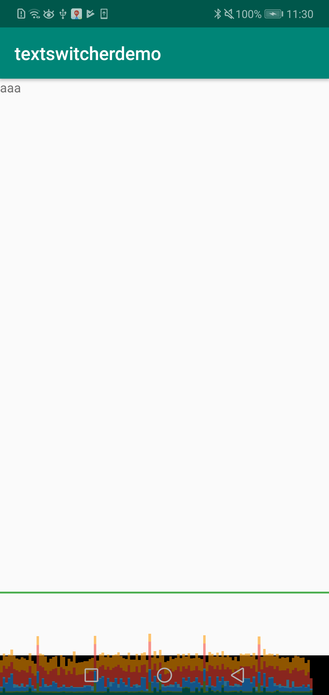
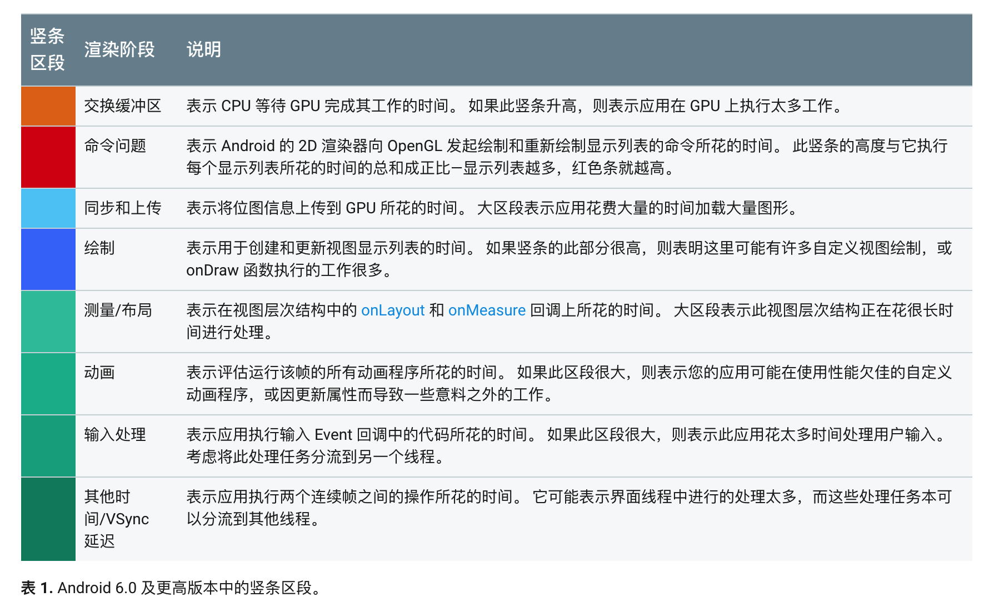
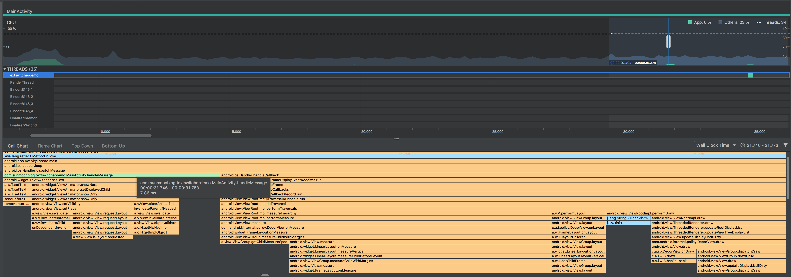
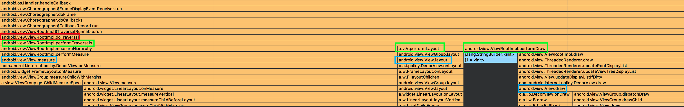

从 TextSwitcher 的低性能说起，顺便聊聊 Android View 的绘制流程。

# 问题
我们 app 文字轮播时遇到性能问题。(当然，问题并不严重，只不过是帧率不高。但问题很诡异)

这里用一个 demo 来演示这个问题。

实际 app 中的布局比这个 demo 复杂得多，所以这里故意加几层 LinearLayout 来加深布局层级，更接近实际便于观察问题。布局文件如下：

```xml
<?xml version="1.0" encoding="utf-8"?>
<android.support.constraint.ConstraintLayout xmlns:android="http://schemas.android.com/apk/res/android"
    xmlns:app="http://schemas.android.com/apk/res-auto"
    android:layout_width="match_parent"
    android:layout_height="match_parent">

    <LinearLayout
        android:layout_width="0dp"
        android:layout_height="0dp"
        app:layout_constraintBottom_toBottomOf="parent"
        app:layout_constraintEnd_toEndOf="parent"
        app:layout_constraintHorizontal_bias="0.5"
        app:layout_constraintStart_toStartOf="parent"
        app:layout_constraintTop_toTopOf="parent">


        <LinearLayout
            android:layout_width="match_parent"
            android:layout_height="match_parent">

            <LinearLayout
                android:layout_width="match_parent"
                android:layout_height="match_parent">

                <TextSwitcher
                    android:id="@+id/textSwitcher"
                    android:layout_width="match_parent"
                    android:layout_height="wrap_content" />

            </LinearLayout>
        </LinearLayout>

    </LinearLayout>

</android.support.constraint.ConstraintLayout>
```

`MainActivity` 中使用 Handler 消息让 textSwitcher 每3秒轮播文字。轮播带简单动画效果，这里就不上动效文件。

```kotlin
class MainActivity : AppCompatActivity(), Handler.Callback {

    val handler = Handler(this)

    override fun handleMessage(msg: Message?): Boolean {
        if (msg?.what == 1) {
            textSwitcher.setText("aaa")
            handler.sendEmptyMessageDelayed(2, 3000)
        } else {
            textSwitcher.setText("bbb")
            handler.sendEmptyMessageDelayed(1, 3000)
        }

        return true
    }

    override fun onCreate(savedInstanceState: Bundle?) {
        super.onCreate(savedInstanceState)
        setContentView(R.layout.activity_main)

        textSwitcher.setFactory{
            TextView(this)
        }

        textSwitcher.inAnimation = AnimationUtils.loadAnimation(this, R.anim.text_switch_push_up_in)
        textSwitcher.outAnimation = AnimationUtils.loadAnimation(this, R.anim.text_switch_push_up_out)

        handler.sendEmptyMessage(1)
    }

    override fun onDestroy() {
        super.onDestroy()
        handler.removeCallbacks(null)
    }
}
```

从图中可以看到每隔3秒就会出现一个很明显的长条。虽然还不至于超过 16ms 的限制，但考虑到这个界面这么简单的情况性能居然也很差，可以推断这其中一定有问题。



这个条形图主要是由绿色区域导致突然变高的。官方文档中提到绿色区域代表 `onLayout` 和 `onMeasure` 回调的耗时。

 [GPU Rendering](https://developer.android.com/studio/profile/inspect-gpu-rendering)

所以我们的问题在于布局性能不高。

使用 Android Profiler 对该问题进行分析。发现 `handleMessage()` 其实处理得很快，只需要6ms左右。真正的问题在于， 

+ `TextSwitcher` 调用了 `View.setVisibility()`并最终调用到  `View.requestLayout()`，
+ `View.requestLayout` 导致整个界面重新布局，每3秒发生一次重新布局



# how android draw views

[How Android Draws Views  |  Android Developers](https://developer.android.com/guide/topics/ui/how-android-draws)

文档中说得比较简单。



结合上面这个图看会很直观：

+ android.view.ViewRootImpl.doTraversal()
  + android.view.ViewRootImpl.measureHierarchy()
    + android.view.View.measure()
  + android.view.ViewRootImpl.performLayout()
    + android.view.View.layout()
  + android.view.ViewRootImpl.performDraw()
    + android.view.View.draw()

> When an Activity receives focus, it will be requested to draw its layout. The Android framework will handle the procedure for drawing, but the Activity must provide the root node of its layout hierarchy.

+ 谁是 Android framework ？- 可以理解为上图中的 `android.view.Choreographer.doFrame()`
+ 谁是 the root node of its layout hierarchy ？ - 可以简单地理解为 `Activity.setContentView()` 中传进入的那个 View (当然实际上它并不是真正的 root node)

[platform_frameworks_base/ViewRootImpl.java at master · aosp-mirror/platform_frameworks_base](https://github.com/aosp-mirror/platform_frameworks_base/blob/master/core/java/android/view/ViewRootImpl.java)

# 优化
如何实现一个高性能版本的 `TextSwitcher` ？

## [TextBannerView](https://github.com/ChessLuo/TextBannerView)
`TextBannerView` 基于 `ViewFlipper` 实现，性能仍然很差

（注意： `TextSwitcher` 也是 `ViewFlipper` 的子类)

## RecyclerView

使用 RecyclerView 来实现跑马灯效果。

+ [效果一](https://www.jianshu.com/p/353c314d3335?from=singlemessage&isappinstalled=0)
+ 