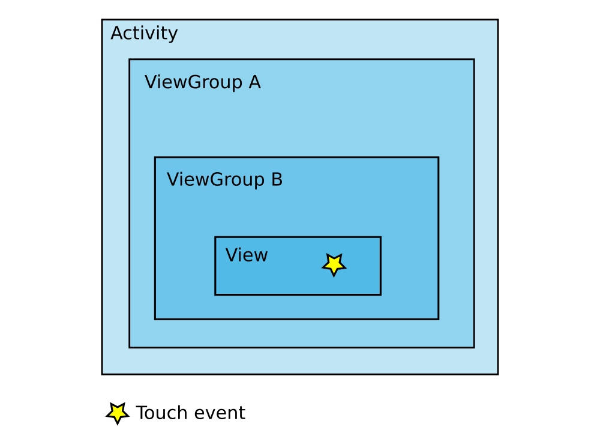
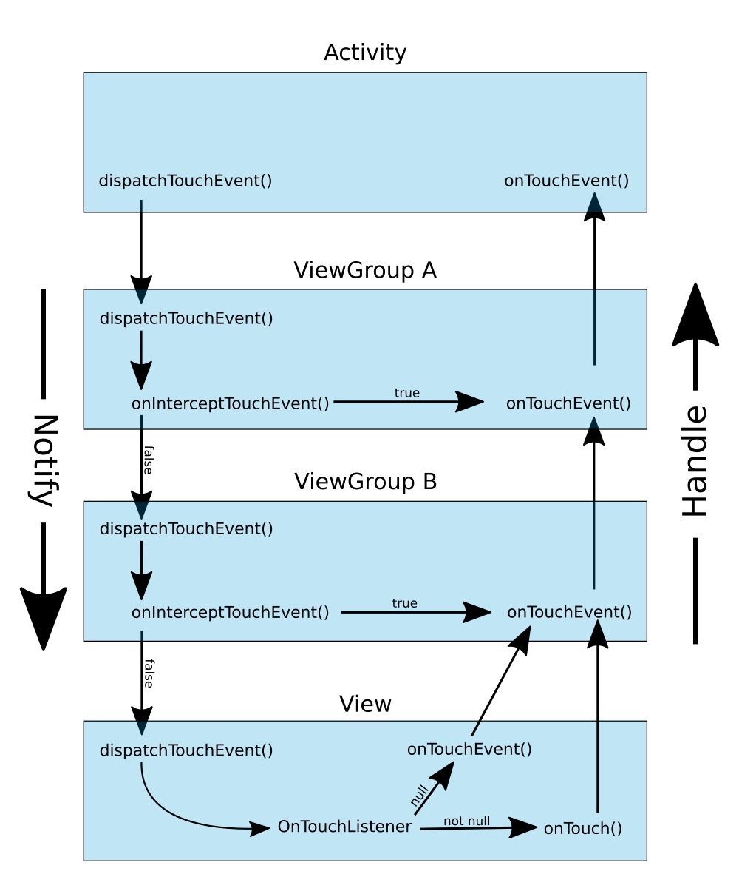

# touch event 是如何分发的

> From Activity viewpoint:
> Touch events are delivered first to Activity.dispatchTouchEvent. It's where you may catch them first.
> Here they get dispatched to Window, where they traverse View hierarchy, in such order that Widgets that are drawn last (on top of other widgets) have chance to process touch in View.onTouchEvent first. If some View returns true in onTouchEvent, then traversal stops and other Views don't receive touch event.
> Finally, if no View consumes touch, it's delivered to Activity.onTouchEvent.
> That's all your control. And it's logical that what you see drawn on top of something else, has chance to process touch event before something drawn below it.

[How are Android touch events delivered? - Stack Overflow](https://stackoverflow.com/questions/7449799/how-are-android-touch-events-delivered)

从 Activity 的角度：

触摸事件首先分发给 `Activity.dispatchTouchEvent`。所以可以在这个方法中获取到触摸事件。

接下来触摸事件分发给 `Window`，它们会在这里遍历 View 树。遍历的顺序跟 Widget 的绘制顺序相反，所以最后一个绘制的 Widget 的 `View.onTouchEvent` 最先被调用。如果其中某个 View 的 onTouchEvent 返回 `true`，则整个遍历过程结束，其他的 View 不会收到触摸事件。

最后，如果没有任何 View 消费触摸事件，它会分发给 `Activity.onTouchEvent` 方法。

绘制在上层的 View，可以先于绘制在下层的 View 来处理触摸事件，这是符合逻辑的。

---

When a touch event occurs, first everyone is notified of the event, starting at the Activity and going all the way to the view on top. Then everyone is given a chance to handle the event, starting with the view on top (view having highest Z order in the touch region) and going all the way back to the Activity. So the Activity is the first to hear of it and the last to be given a chance to handle it.

当产生触摸事件时，首先图中的这几个元素会收到这个事件，接收过程是从 Activity 开始的，然后是 View (从上层的 View 开始)。然后，每个元素都有机会处理该事件，也是从上层的 View 开始 (在触摸区域中有最高等级的 Z 值)，最后会回到 Activity。如果 Activity 是第一个知道触摸事件的，但最后才有机会处理它。

(这个图真是牛，完全解释清楚了。图片来源 https://stackoverflow.com/questions/7449799/how-are-android-touch-events-delivered)

如果某个 ViewGroup 想处理立即触摸事件(并且接下来不给任何元素处理机会)，则它在 `onInterceptTouchEvent()` 返回 `true` 即可。也可以在 `Activity.dispatchTouchEvent()` 方法中进行类似处理。

如果一个 View 或 ViewGroup 有 `OnTouchListener`，则触摸事件由 `OnTouchListener.onTouch()` 处理，否则由它自己的 `onTouchEvent()` 处理。如果 `onTouchEvent()` 返回 `true`，则整个流程到此结束，接下来的任何元素都收不到触摸事件。

## 更多细节
上图比实际代码要简单。比如，在 Activity 和 ViewGroup A (根布局)之间有 Window 和 DecorView。我没有画出它们是因为通常不会影响触摸事件处理流程。但接下来我会讲到它们。以下的描述是从源码角度来看的

(注意：源码可能有更新，所以行号不对)

+ Activity 的 [dispatchTouchEvent()](https://android.googlesource.com/platform/frameworks/base/+/master/core/java/android/app/Activity.java#3288) 方法收到触摸事件。触摸事件作为 `MotionEvent` 传进来，其中包含 x 坐标、y 坐标、时间、事件类型以及其他信息
+ 触摸事件分发给 Window 的 [superDispatchTouchEvent()](https://android.googlesource.com/platform/frameworks/base/+/master/core/java/android/view/Window.java#1593) 方法。`Window` 是一个抽象类。其实现是 [PhoneWindow](https://android.googlesource.com/platform/frameworks/base/+/696cba573e651b0e4f18a4718627c8ccecb3bda0/policy/src/com/android/internal/policy/impl/PhoneWindow.java#1241)。
+ 接下来是 DecorView 的 [superDispatchTouchEvent](https://android.googlesource.com/platform/frameworks/base.git/+/master/core/java/com/android/internal/policy/DecorView.java#444)。`DecorView` 类处理 status bar、navigation bar、content area 等等。实际上它是 `FrameLayout` 的子类，而 `FrameLayout` 是 `ViewGroup` 的子类。
+ 再接下来是 Activity 的 content view，它是在 Android Studio 的 Layout Editor 中的 xml 布局文件的根布局。`RelativeLayout`、`LinearLayout` 以及 `ConstraintLayout` 等布局，都是 `ViewGroup` 的子类。ViewGroup 在 [dispatchTouchEvent()](https://android.googlesource.com/platform/frameworks/base/+/master/core/java/android/view/ViewGroup.java#2473) 中收到触摸事件。这里的 ViewGroup 即图中的 ViewGroup A。
+ ViewGroup 会[将触摸事件分发给其子节点](https://android.googlesource.com/platform/frameworks/base/+/master/core/java/android/view/ViewGroup.java#2983)，包括任何 ViewGroup 类型的子节点。这里的 ViewGroup 子节点即图中的 ViewGroup B。
+ ViewGroup 可以通过在 [onInterceptTouchEvent()](https://android.googlesource.com/platform/frameworks/base/+/master/core/java/android/view/ViewGroup.java#3123) 方法中返回 `true` 的方式来 [short-circuit](https://android.googlesource.com/platform/frameworks/base/+/master/core/java/android/view/ViewGroup.java#2504)
+ 假设没有 ViewGroup 来结束触摸事件传递流程，该事件会分发给 View 的 [dispatchTouchEvent()](http://%60dispatchtouchevent%28%29%60/)
+ 这一步是处理触摸事件。[如果有 OnTouchListener](https://android.googlesource.com/platform/frameworks/base/+/android-4.3_r2.1/core/java/android/view/View.java#7379)，会首先调用 [OnTouchListener.onTouch](https://android.googlesource.com/platform/frameworks/base/+/android-4.3_r2.1/core/java/android/view/View.java#17783) 来处理触摸事件。否则，[View.onTouchEvent](https://android.googlesource.com/platform/frameworks/base/+/android-4.3_r2.1/core/java/android/view/View.java#8302) 来处理触摸事件
+ 所有的 ViewGroup 和 View 都有同样的机会处理触摸事件。图中没有说明的一点是 ViewGroup 是 View 的子类，所在 `OnTouchListener.onTouch()` 和 `onTouchEvent()` 同样也适用于 ViewGroup
+ 最后由 Activity [onTouchEvent()](https://android.googlesource.com/platform/frameworks/base/+/master/core/java/android/app/Activity.java#3024) 来处理触摸事件

## FAQ
**什么时候覆盖 dispatchTouchEvent()？**

当需要在任何 View 处理触摸事件之前获取这些事件时，需要覆盖 `Activity.dispatchTouchEvent()`。对于 ViewGroup，只用覆盖 `onInterceptTouchEvent()` 和 `onTouchEvent()` 即可。

**什么时候覆盖 onInterceptTouchEvent()?**

覆盖该方来窥探触摸事件，记得返回 `false`.

但是该方法的主要目是是让 ViewGroup 可以处理一些特定类的触摸事件，而让子节点可以处理另外一些类型的事件。比如，`ScrollView` 就是这样来处理 scrolling 的，同时允许子节点处理类似 Button 点击这样的操作。反之，如果子节点不想让父节点窥探触摸事件，它可以调用 `requestDisallowTouchIntercept()`。

**触摸事件有哪些类型?**

主要类型包括：

+ `ACTION_DOWN` - 这是触摸事件的开始。如果想处理触摸事件，遇到 `ACTION_DOWN` 类型事件时总是要返回 `true`。否则，你将无法接收到接下来的触摸事件。 
+ `ACTION_MOVE` - 接下来当你手指在屏幕上移动时会收到这种类型的事件。
+ `ACTION_UP` - 这是最后的事件。

[这里](https://developer.android.com/reference/android/view/MotionEvent.html)可以看到更多的类型的触摸事件。另外需要注意的是，Android 支持多点触摸。

# 更多参考

+ Android onTouchEvent [Part 1](https://www.youtube.com/watch?v=SYoN-OvdZ3M), [Part 2](https://www.youtube.com/watch?v=nOcznwNEBf4), and [Part 3](https://www.youtube.com/watch?v=GIWQn90av54) (YouTube video - good summary of some of the links below)
+ [Mastering the Android Touch System](https://www.youtube.com/watch?v=EZAoJU-nUyI) (thorough video by Google developer)
+ [Android UI Internal : Pipeline of View's Touch Event Handling](http://pierrchen.blogspot.com/2014/03/pipeline-of-android-touch-event-handling.html)
+ [Managing Touch Events in a ViewGroup (Android docs)](https://developer.android.com/training/gestures/viewgroup.html)
+ [Input Events](https://developer.android.com/guide/topics/ui/ui-events.html) (Android docs)
+ [Gestures and Touch Events](https://github.com/codepath/android_guides/wiki/Gestures-and-Touch-Events)

# 来源 
+ [How are Android touch events delivered? - Stack Overflow](https://stackoverflow.com/questions/7449799/how-are-android-touch-events-delivered)
+ [How are Android touch events delivered](https://medium.com/@studymongolian/how-touch-events-are-delivered-in-android-eee3b607b038)