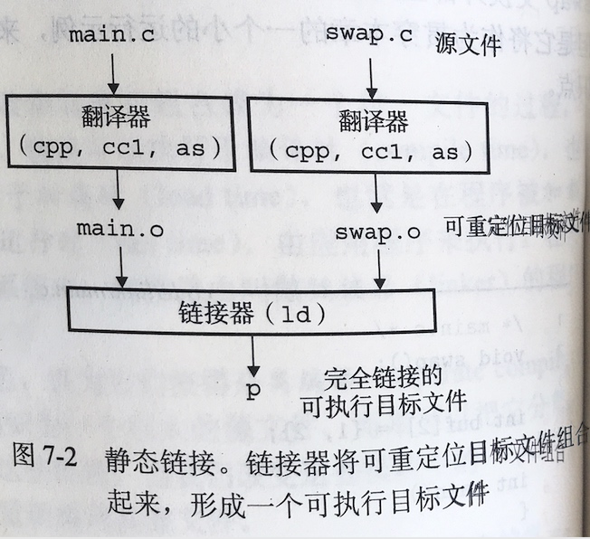
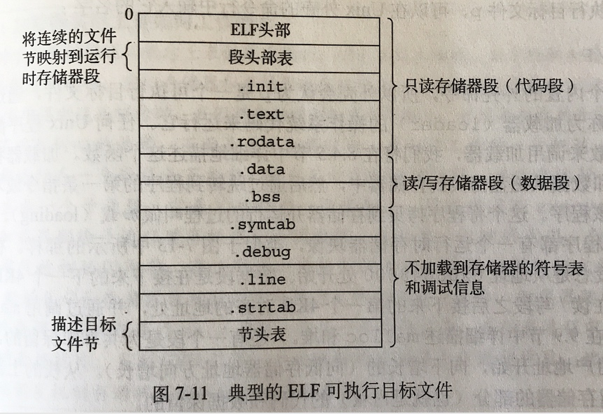
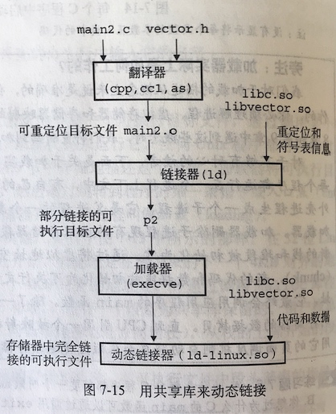

[TOC]

# 第七章 - 链接

+ 什么是链接(linking)?
+ 什么是加载(loading)?
+ 链接可以发生在哪些时机?
+ 链接器带来什么好处?
+ 为什么需要理解关于链接的知识?
+ 链接器的主要任务是什么?
+ 静态链接过程是怎样的?
+ 什么是目标文件?它有几种形式?
+ ELF 格式?
+ C++和Java如何处理重载方法?
+ 什么是静态库(static library)? 它的好处是什么?
+ 加载器虽如何工作的?
+ 什么是共享库(shared library)? 它的好处是什么?
+ 什么是动态链接(dynamic linking)?
+ 有哪些用于处理目标文件的工具?

什么是链接(linking)?

> 链接是将各种代码和数据部分收集起来并组合成一个单一文件的过程

什么是加载(loading)?

> 加载器将可执行目标文件中的代码和数据从磁盘拷贝到存储器中，然后通过跳转到程序的第一条指令或入口点(entry point)来运行该程序。这个过程叫加载

链接可以发生在哪些时机?

> 链接可以在编译时(compile time)由静态链接器(ld)来完成，也可以在加载时(load time)和运行时(run time)由动态链接器(ld-linux.so)来完成

链接器带来什么好处?

> **分离编译**，可以将大型程序分解为更小、更好管理的模块

为什么需要理解关于链接的知识?

+ 帮助构建大型程序
+ 理解同名全局问题原因
+ 使用共享库

链接器的主要任务是什么?

+ 符号解析(symbol resolution)
+ 重定位(relocation)

静态链接过程是怎样的?

什么是目标文件?

> 目标文件是字节块的集合。有些包含程序代码，有些包含程序数据，有些包含指导链接器和加载器的数据结构

目标文件有几种形式?

三种形式。包括

+ 可重定位目标文件
+ 可执行目标文件
+ 共享目标文件

编译器(ccl)和汇编器(as)的输出是什么?

> 可重定位目标文件(包括共享目标文件)

链接器的输出是什么?

> 可执行目标文件

ELF 格式?

> 各个系统之间目标格式文件都不相同。现代 Unix 系统(包括 Linux) 使用的是 *Unix 可执行和可链接格式* (Executable and Linkable Format, ELF)

C++和Java如何处理重载方法?

> 它们使用 mangling 技术来重载方法。编译器将每个唯一的方法和参数列表组合编码成一个对链接器来说唯一的名字

什么是静态库(static library)? 它的好处是什么?

编译系统可以将所有相关的目标模块打包成为一个单独的文件，该文件称为静态库。

| 系统库实现方案                           | 优点                   | 缺点                       |
|-----------------------------------|----------------------|--------------------------|
| 编译器直接支持标准函数                       | 对应用开发者很方便，标准函数总是可用   | 编译器复杂性增加，标准库更新时要求编译器也更新  |
| 标准库放在目标文件中(如libc.o)               | 编译器的实现与标准函数的实现分离     | 每个可执行目标文件包含全部标准函数，浪费磁盘空间 |
| 静态库, 相关函数编译到独立文件(如libc.a, libm.a) | 链接器只拷贝被引用的静态库，节省磁盘空间 |符号解析时的重名问题                     |

加载器虽如何工作的?

+ 父进程创建(fork)子进程
+ 子进程调用启动加载器(execve)
+ 加载器建立 Linux 运行时存储器映像 (虚拟地址空间)
    + 先删除原有虚拟存储段
    + 再拷贝可执行程序的相关内容到代码和数据段
+ 加载器跳转到 `_start` 地址开始执行

什么是共享库(shared library)? 它的好处是什么?

> 共享库是一个目标模块，可以在运行时被加载到任意的存储器地址，并和一个在存储器中的程序链接起来
> 解决了静态库维护更新问题(需要重新链接)以及浪费存储器空间问题

什么是动态链接(dynamic linking)?

如何理解共享库的"共享"？

> 首先，在文件系统上对一个库只有一个 .so 文件，不必像静态库那些嵌入到可执行目标文件
> 其次，存储器上共享库的 .text 节的同一个副本可以被不同进程共享

有哪些用于处理目标文件的工具?

+ NM
+ READELF
+ OBJDUMP
+ AR
+ STRINGS