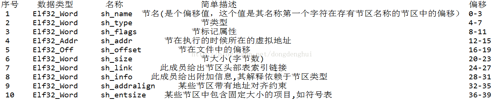

# 基本原理

+ 从 `/proc/self/maps` 找到指定 so 的内存基址
+ mmap 将指定的 so 读取到内存 (Elf_Ehdr)
+ 分析 Elf_Ehdr

# dlopen 与 dlsym

# Elf_Ehdr
数据结构定义见 `elf.h`。

Elf_Sym

# 系统调用

+ 找出内存基址 - fopen, fclose, fgets, strstr, sscanf 
+ 找出方法地址 - strcmp
+ 找出文件大小 - open, close, lseek
+ 分配内存 - calloc, malloc
+ 内存映射 - mmap, munmap

