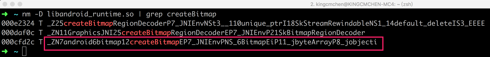

# 命名空间
Namespaces provide a method for preventing name conflicts in large projects.


# 引用

A reference variable is an alias, that is, another name for an already existing variable. A reference, like a pointer is also implemented by storing the address of an object. A reference can be thought of as a constant pointer (not to be confused with a pointer to a constant value) with automatic indirection, i.e the compiler will apply the * operator for you.

使用指针实现的 `swap()`：

```cpp
// i and j are pointers to ints
void swap(int* i, int *j)
{
    int temp = *i; // dereference i
    *i = *j;
    *j = temp;
}

// have to pass pointers to a and b
swap(&a, &b);
```

使用引用实现的 `swap()`：

```cpp
// i and j are references to ints
inline void swap(int &i, int &j)
{
    int temp i; // no need to dereference
    i = j;
    j = temp;
}

// no need to pass pointers
swap(a, b);
```

# 参考

[utkuufuk/cpp-quick-reference: C++ Quick Reference](https://github.com/utkuufuk/cpp-quick-reference)


====


Hook 的目标 [source](https://android.googlesource.com/platform/frameworks/base/+/refs/heads/master/core/jni/android/graphics/Bitmap.cpp#199)

```
jobject createBitmap(JNIEnv* env, Bitmap* bitmap,
        int bitmapCreateFlags, jbyteArray ninePatchChunk, jobject ninePatchInsets,
        int density) {
    bool isMutable = bitmapCreateFlags & kBitmapCreateFlag_Mutable;
    bool isPremultiplied = bitmapCreateFlags & kBitmapCreateFlag_Premultiplied;
    // The caller needs to have already set the alpha type properly, so the
    // native SkBitmap stays in sync with the Java Bitmap.
    assert_premultiplied(bitmap->info(), isPremultiplied);
    BitmapWrapper* bitmapWrapper = new BitmapWrapper(bitmap);
    jobject obj = env->NewObject(gBitmap_class, gBitmap_constructorMethodID,
            reinterpret_cast<jlong>(bitmapWrapper), bitmap->width(), bitmap->height(), density,
            isMutable, isPremultiplied, ninePatchChunk, ninePatchInsets);
    if (env->ExceptionCheck() != 0) {
        ALOGE("*** Uncaught exception returned from Java call!\n");
        env->ExceptionDescribe();
    }
    return obj;
}
```

Hook 的目标被打包到 `libandroid_runtime.so` [source](https://android.googlesource.com/platform/frameworks/base/+/refs/heads/master/core/jni/Android.bp#11)

`nm` 用于查看 so 中的函数名：

```
➜  ~ nm -D libart.so | grep AddWeakGlobalRe
00230f20 T _ZN3art9JavaVMExt16AddWeakGlobalRefEPNS_6ThreadENS_6ObjPtrINS_6mirror6ObjectEEE
```

Hook 的在 `libandroid_runtime.so` 中的名字是

`_ZN7android6bitmap12createBitmapEP7_JNIEnvPNS_6BitmapEiP11_jbyteArrayP8_jobjecti`。





# 参考
[C++ Quick Syntax Reference](http://kali.azc.uam.mx/clc/03_docencia/licenciatura/i_programacion/Libro_C++.pdf)

[utkuufuk/cpp-quick-reference: C++ Quick Reference](https://github.com/utkuufuk/cpp-quick-reference)

[Android changes for NDK developers](https://android.googlesource.com/platform/bionic/+/master/android-changes-for-ndk-developers.md)

[Android Developers Blog: Improving Stability with Private C/C++ Symbol Restrictions in Android N](https://android-developers.googleblog.com/2016/06/improving-stability-with-private-cc.html)

[binutils](http://ftp.gnu.org/gnu/binutils/)

[JNI tips  |  Android NDK  |  Android Developers](https://developer.android.com/training/articles/perf-jni)