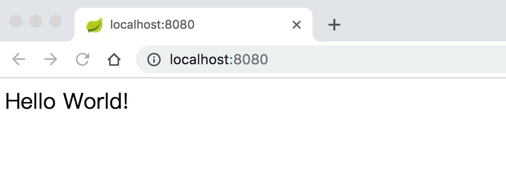

# 第一个 Spring Boot 应用

+ 创建工程
+ 导入工程
+ 运行工程
+ 访问

## 创建工程

在 [Spring Initializr](https://start.spring.io/) 上配置一下即可生成一个工程。工程下载下来之后是一个 Zip 包。

## 导入工程

解压 Zip 包，将其作为 Gradle 项目导入 IDEA。

## 运行工程

打开项目，添加如下代码：

```java
@RestController
@SpringBootApplication
public class DemoApplication {

	@RequestMapping("/")
	String home() {
        System.out.println("这是一个java应用");
        return "Hello World!";
	}

	public static void main(String[] args) {
		SpringApplication.run(DemoApplication.class, args);
	}

}
```

执行 `./gradlew bootRun` 命令。该命令启动 Tomcat，在 8080 端口启动 HTTP 服务。



# Spring boot 介绍

问：有什么好处？
答：默认配置，减少开发者时间。[ref](https://baijiahao.baidu.com/s?id=1607737702329599976&wfr=spider&for=pc)

问：如何开启 [hot swapping](https://docs.spring.io/spring-boot/docs/current/reference/htmlsingle/#howto-hotswapping)
答：见这里 [hot swapping](https://docs.spring.io/spring-boot/docs/current/reference/htmlsingle/#howto-hotswapping)

# 参考

[Building an Application with Spring Boot](https://spring.io/guides/gs/spring-boot/)

[Getting Started · Building a RESTful Web Service with Spring Boot Actuator](https://spring.io/guides/gs/actuator-service/)
