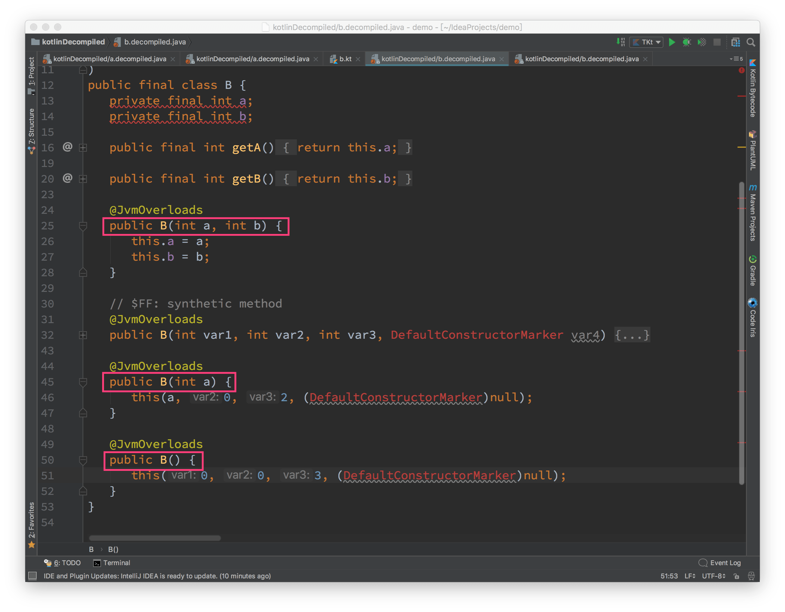

# invoke

Objects with invoke() method can be invoked as a function  [ref](https://try.kotlinlang.org/#/Kotlin%20Koans/Conventions/Invoke/Task.kt) [ref2](https://kotlinlang.org/docs/reference/operator-overloading.html)

```kotlin
fun Int.invoke() { println(this) }

1() //huh?..

class Invokable {
    var numberOfInvocations: Int = 0
        private set
    operator fun invoke(): Invokable {
        numberOfInvocations++
        return this
    }
}

fun invokeTwice(invokable: Invokable) = invokable()()
```

# init 关键字

主构造函数不能包含任何的代码。初始化的代码可以放到以 init 关键字作为前缀的初始化块（initializer blocks）中。 [ref](https://www.kotlincn.net/docs/reference/classes.html)

在实例初始化期间，初始化块按照它们出现在类体中的顺序执行，与属性初始化器交织在一起：

```kotlin
class InitOrderDemo(name: String) {
    val firstProperty = "First property: $name".also(::println)

    init {
        println("First initializer block that prints ${name}")
    }

    val secondProperty = "Second property: ${name.length}".also(::println)

    init {
        println("Second initializer block that prints ${name.length}")
    }
}
```

输出：

```
First property: hello
First initializer block that prints hello
Second property: 5
Second initializer block that prints 5
```
 
# @JvmOverloads 注解

如果对不带缺省参数的方法使用 `@JvmOverloads`，会有如下警告：

`@JvmOverloads has no effect for methods without default argments`

`@JvmOverloads` 对缺省参数到底有什么影响呢？看下面的例子，有两个类：

+ `A`，构造方法不使用 `@JvmOverloads` 注解 
+ `B`，构造方法使用 `@JvmOverloads` 注解 

```kotlin
class A constructor(val a: Int = 0, val b: Int = 0) 
```

```kotlin
class B @JvmOverloads constructor(val a : Int = 0, val b : Int = 0)
```

二者生成的字节码有所不同。将生成的字节码转换成对应的 Java 代码分别如下：

(转换方法：Idea > Tools > Show Kotlin Bytecode > Decompile)



```java
public final class A {
   private final int a;
   private final int b;

   ...
   public A(int a, int b) {
      this.a = a;
      this.b = b;
   }

   public A() {
      this(0, 0, 3, (DefaultConstructorMarker)null);
   }
```

```java
public final class B {
   private final int a;
   private final int b;

   ...

   @JvmOverloads
   public B(int a, int b) {
      this.a = a;
      this.b = b;
   }
   @JvmOverloads
   public B(int a) {
      this(a, 0, 2, (DefaultConstructorMarker)null);
   }

   @JvmOverloads
   public B() {
      this(0, 0, 3, (DefaultConstructorMarker)null);
   }

   ...
```

区别在于：`B` 类多出了不带参数的构造方法和带一个参数的构造方法。

所以 `@JvmOverloads` 可以为 Kotlin 与 Java 代码交互带来一些方便。举个例子，自定义 `View`：

```kotlin
class MyView @JvmOverloads constructor(context: Context,
    attributes: AttributeSet? = null, defStyleAttr: Int = 0)
    : View(context, attributes, defStyleAttr) {}
```

这样写是不是方便很多？
