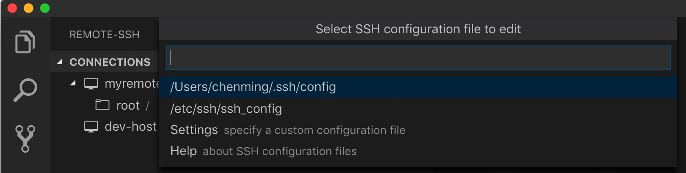

# git

## 找出被删除文件的历史记录

```
// 不知道文件名或文件路径时
git log --all --full-history -- **/thefile.*
// 知道文件名或文件路径时
git log --all --full-history -- <path-to-file>
```

## 免密码操作

```
git config credential.helper store
```

执行上一条命令后，当git push的时候输入一次用户名和密码就会被记录

注意：这样保存的密码是明文的，保存在用户目录~的.git-credentials文件中

## git:// 代理

1. 从[gist](https://gist.github.com/sit/49288)下载脚本作为可执行文件 `gitproxy-socat`
2. `git config --global core.gitproxy gitproxy-socat` 配置代理。 参考[ref](https://git-scm.com/docs/git-config)

```
#!/bin/sh
# Use socat to proxy git through an HTTP CONNECT firewall.
# Useful if you are trying to clone git:// from inside a company.
# Requires that the proxy allows CONNECT to port 9418.
#
# Save this file as gitproxy somewhere in your path (e.g., ~/bin) and then run
#   chmod +x gitproxy
#   git config --global core.gitproxy gitproxy
#
# More details at http://tinyurl.com/8xvpny

# Configuration. Common proxy ports are 3128, 8123, 8000.
_proxy=proxy.yourcompany.com
_proxyport=3128

exec socat STDIO PROXY:$_proxy:$1:$2,proxyport=$_proxyport
```

参考:

+ [stackoverflow](https://stackoverflow.com/questions/5860888/git-through-proxy)
+ [v2ex](https://www.v2ex.com/t/332816)
+ [A simple wrapper around socat to use as a git proxy command](https://gist.github.com/sit/49288)
+ [Git - git-config Documentation](https://git-scm.com/docs/git-config)

# Python

`easy_install` 被废弃了, 使用以下方式安装 `pip`。

```
curl https://bootstrap.pypa.io/get-pip.py -o get-pip.py
sudo python get-pip.py
```

# Android SDK

远程 Linux 机器上安装 Android SDK

```
wget https://dl.google.com/dl/android/studio/ide-zips/3.5.0.21/android-studio-ide-191.5791312-linux.tar.gz
wget https://dl.google.com/android/repository/platform-tools_r29.0.3-linux.zip
wget https://dl.google.com/android/android-sdk_r24.4.1-linux.tgz
```

更新 Android SDK

```
android update sdk --no-ui --proxy-host <host> --proxy-port <port>
```

远程 Linux 机器安装 Java

```
//yum install java
yum install java-1.8.0-openjdk-devel
```

+ [参考](https://www.vogella.com/tutorials/JenkinsAndroid/article.html)
+ [参考](https://developer.android.com/studio/command-line/sdkmanager)
+ [参考](https://developer.android.com/studio/command-line)
+ [参考](https://www.jianshu.com/p/92cf851c6620)


# curl

curl 发送 POST 请求

```
curl -X POST http://aaa/bbb -H @appmap.prop -d '
{
    "a": 1,
    "b", 2
}
'
```

curl 上传文件

```
curl http://ip:8000/log/ -F "file=@average.png" -v
```

# 图片压缩
[pngquant — lossy PNG compressor](https://pngquant.org/)

[ImageOptim — better Save for Web](https://imageoptim.com/mac)

[TinyPNG](https://tinypng.com/)

[gruntjs/grunt-contrib-imagemin](https://github.com/gruntjs/grunt-contrib-imagemin)

# ss

参考自 [Mac 端如何配置 ss – 冰冰的小屋](http://16bing.com/2017/02/18/mac-shadowsocks/)

## 安装

```
pip3 install ss
```

## 启动

通过命令行指定参数：

```
ss -p 8080 -k password -m rc4-md5 -d start
```

通过配置文件指定参数：

```
ss -c /etc/ss.json -d start
```

## 配置
配置文件见 `/etc/ss.json`：

```json
{
  "server": "0.0.0.0",
  "server_port": 8080,
  "local_port": 1080,
  "password": "123456",
  "timeout": 600,
  "method": "rc4-md5"
}
```

# Anki

## 安装

```
easy_install AnkiServer
```

## 配置

```
mkdir Anki
cd Anki
cp /usr/local/lib/python2.7/dist-packages/AnkiServer-2.0.6-py2.7.egg/examples/example.ini production.ini
vi producion.ini
```

配置文件内容如下：

```
host= 10.XX.XX.XX  #自己服务器的地址
allowed_hosts=0.0.0.0 #允许同步的客户端ip地址，使用0.0.0.0表示允许任何ip地址连接
```

添加anki用户

```
ankiserverctl.py adduser username
```

## 启动

调试模式启动anki

```
ankiserverctl.py debug [configfile]
```

正常启动anki

```
ankiserverctl.py start [cofigfile]
```

# vscode

vscode 支持远程开发。配置步骤如下：

+ 生成 ssh-key - `ssh-keygen -t rsa -b 4096 -f ~/.ssh/id_rsa-remote-ssh`
+ 上传 ssh-key - `ssh-copy-id -p 36000 root@1.1.1.2`
+ 配置 vscode ssh-remote 插件




配置文件：

```
# Read more about SSH config files: https://linux.die.net/man/5/ssh_config
Host dev-host
    HostName 1.1.1.2
    User root
    Port 36000
    IdentityFile ~/.ssh/id_rsa-remote-ssh
```

这里记录配置过程中遇到的一个问题：远程机需要代理上网，vscode 一直卡在 `connect vscode remote server retry` 这个地方。

卡住的原因是 vscode 成功通过 ssh 连接上远程机上后还需要在远程机上下载安装一些命令，代理原因导致这一步不成功，所以卡住了。

解决办法：可以手动从 https://update.code.visualstudio.com/commit:<commit-id>/server-linux-x64/stable 下载文件，并且保存在如下位置。

```
~/.vscode-server/bin/2213894ea0415ee8c85c5eea0d0ff81ecc191529/vscode-server-linux-x64.tar.gz
```

重新打开 vscode remote 插件进行配置，成功！

+ [#issue 78](https://github.com/microsoft/vscode-remote-release/issues/78)
+ [Developing on Remote Machines using SSH and Visual Studio Code](https://code.visualstudio.com/docs/remote/ssh)

# node

这里记录一个在 centos 上安装 node 遇到的问题：[javascript - node: relocation error: node: symbol SSL_set_cert_cb, version libssl.so.10 not defined in file libssl.so.10 with link time reference - Stack Overflow](https://stackoverflow.com/questions/46473376/node-relocation-error-node-symbol-ssl-set-cert-cb-version-libssl-so-10-not-d)


## 参考
+ [手把手教你搭建自己专属的Anki服务器 - 简书](https://www.jianshu.com/p/c50e3feec878)
+ [anki-sync-server](https://github.com/dsnopek/anki-sync-server)
+ [Anki-Android](https://github.com/ankidroid/Anki-Android)
+ [anki](https://github.com/dae/anki)
