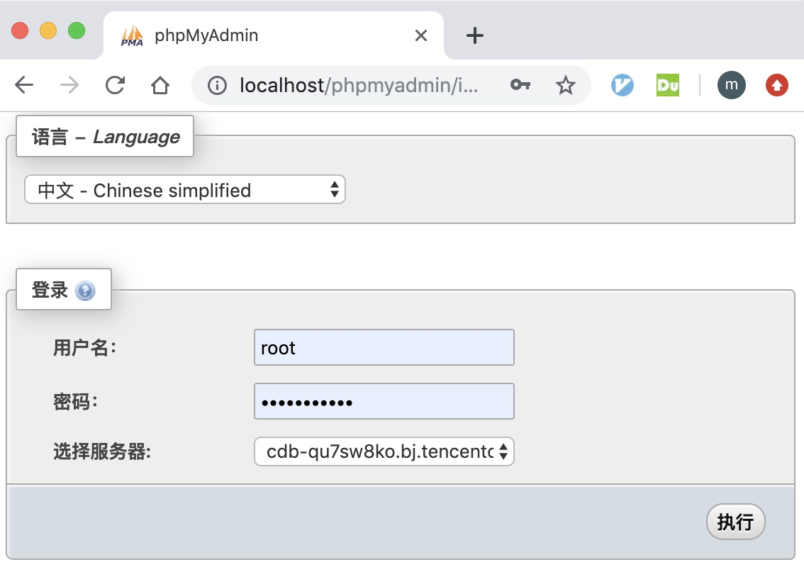

# phpmyadmin 的安装配置

安装配置步骤简单总结如下：

1. 下载 [phpMyAdmin](https://www.phpmyadmin.net/)
2. 将 zip 压缩包解压到 `/Library/WebServer/Documents` 下，命名为 `phpmyadmin`
3. `sudo chmod -R 755 phpmyAdmin/` 修改目录权限
4. 配置

## 检查 Apache 和 PHP

Mac 上已安装 Apache 和 PHP。

首先检查 php 版本：

```
➜  Documents php -v
PHP 7.1.23 (cli) (built: Nov  7 2018 18:20:35) ( NTS )
Copyright (c) 1997-2018 The PHP Group
Zend Engine v3.1.0, Copyright (c) 1998-2018 Zend Technologies
```

Apache 管理命令如下。

```
sudo apachectl start
sudo apachectl stop
sudo apachectl restart
```

启动 Apache 服务后，可以访问 localhost 检查服务是否正常。正常情况下显示如所示：


## PHP 配置

开启 Apache PHP 模块的方法是在 `/etc/apache2/httpd.conf` 文件中开启如下配置：

```
LoadModule php7_module libexec/apache2/libphp7.so
```

同一文件中添加如下配置，允许访问 `phpadmin`。

```
<Directory "/Library/WebServer/Documents/phpmyadmin">
    Options FollowSymLinks Multiviews
    MultiviewsMatch Any
    AllowOverride All
    Allow from all
</Directory>
```

编辑 `config.inc.php` 下的配置，添加数据库地址和端口。

```
/**
 * First server
 */
$i++;
/* Authentication type */
$cfg['Servers'][$i]['auth_type'] = 'cookie';
/* Server parameters */
$cfg['Servers'][$i]['host'] = '地址';
$cfg['Servers'][$i]['port'] = '端口';
$cfg['Servers'][$i]['compress'] = false;
$cfg['Servers'][$i]['AllowNoPassword'] = false;
```

## 使用 phpmyadmin

配置完成后启动 Apache 服务：

```
sudo apachectl start
```

访问 `http://localhost/phpmyadmin/index.php` 即可开始使用 phpadmin 管理数据库。


